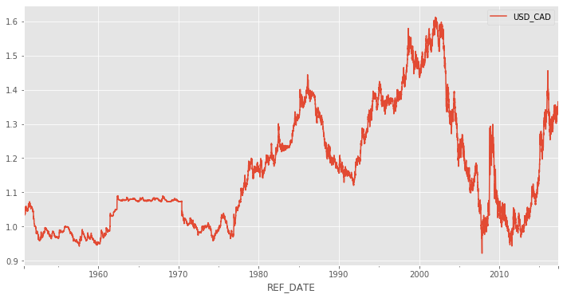
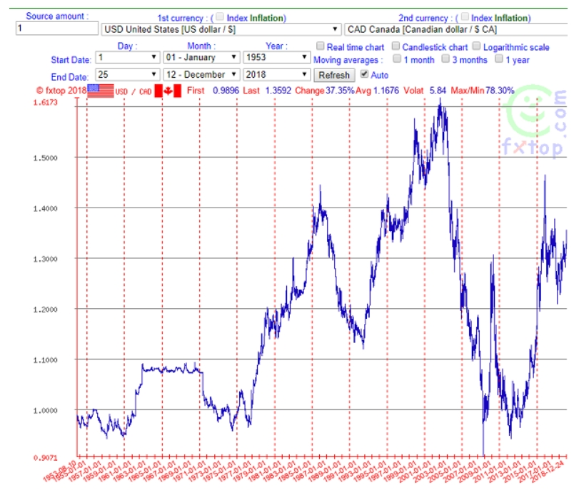

## Data Science for Algorthmmic Trading
### Part 1 : US/CAD 환율 데이터 전처리

- 참고자료 : https://towardsdatascience.com/data-science-in-algorithmic-trading-d21a46d1565d


Initial upload: 2020.07.25   
Last update: 2020.07.25 


여기서는 환율정보 분석에 대하여 설명한다. **위 참고자료의 내용을 번역, 필사하고, 일부 내용을 추가한 것이다.**   
환율은 영어로 exchange rate이다. 그런데 기준통화/대상통화(A/B) 형태로 표현할 때 Currency pair라고 부른다. 


```python
import numpy as np
import pandas as pd
import matplotlib.pyplot as plt
import warnings; warnings.filterwarnings('ignore')
plt.style.use('ggplot')
%matplotlib inline

# Options for pandas
pd.options.display.max_columns = 20
```


### 1. 데이터 읽어오기  

- 여기서는 USD/CAD currency pair 데이터셋을 살펴본다.[[데이터주소]](https://open.canada.ca/data/en/dataset/1bc25b1e-0e02-4a5e-afd7-7b96d6728aac)


```python
# meta = pd.read_csv('10100008_MetaData.csv')
rates = pd.read_csv('10100008.csv')
```


```python
rates.head()
```

<table border="1" class="dataframe">
  <thead>
    <tr style="text-align: right;">
      <th></th>
      <th>REF_DATE</th>
      <th>GEO</th>
      <th>DGUID</th>
      <th>Type of currency</th>
      <th>UOM</th>
      <th>UOM_ID</th>
      <th>SCALAR_FACTOR</th>
      <th>SCALAR_ID</th>
      <th>VECTOR</th>
      <th>COORDINATE</th>
      <th>VALUE</th>
      <th>STATUS</th>
      <th>SYMBOL</th>
      <th>TERMINATED</th>
      <th>DECIMALS</th>
    </tr>
  </thead>
  <tbody>
    <tr>
      <th>0</th>
      <td>1950-10-02</td>
      <td>Canada</td>
      <td>NaN</td>
      <td>United States dollar, noon spot rate</td>
      <td>Dollars</td>
      <td>81</td>
      <td>units</td>
      <td>0</td>
      <td>v121716</td>
      <td>1.10</td>
      <td>1.060000</td>
      <td>NaN</td>
      <td>NaN</td>
      <td>NaN</td>
      <td>8</td>
    </tr>
    <tr>
      <th>1</th>
      <td>1950-10-02</td>
      <td>Canada</td>
      <td>NaN</td>
      <td>Danish krone, noon spot rate</td>
      <td>Dollars</td>
      <td>81</td>
      <td>units</td>
      <td>0</td>
      <td>v121743</td>
      <td>1.40</td>
      <td>0.153459</td>
      <td>NaN</td>
      <td>NaN</td>
      <td>NaN</td>
      <td>8</td>
    </tr>
    <tr>
      <th>2</th>
      <td>1950-10-02</td>
      <td>Canada</td>
      <td>NaN</td>
      <td>Norwegian krone, noon spot rate</td>
      <td>Dollars</td>
      <td>81</td>
      <td>units</td>
      <td>0</td>
      <td>v121717</td>
      <td>1.10</td>
      <td>0.148400</td>
      <td>NaN</td>
      <td>NaN</td>
      <td>NaN</td>
      <td>8</td>
    </tr>
    <tr>
      <th>3</th>
      <td>1950-10-02</td>
      <td>Canada</td>
      <td>NaN</td>
      <td>Swedish krona, noon spot rate</td>
      <td>Dollars</td>
      <td>81</td>
      <td>units</td>
      <td>0</td>
      <td>v121718</td>
      <td>1.11</td>
      <td>0.204800</td>
      <td>NaN</td>
      <td>NaN</td>
      <td>NaN</td>
      <td>8</td>
    </tr>
    <tr>
      <th>4</th>
      <td>1950-10-02</td>
      <td>Canada</td>
      <td>NaN</td>
      <td>Swiss franc, noon spot rate</td>
      <td>Dollars</td>
      <td>81</td>
      <td>units</td>
      <td>0</td>
      <td>v121719</td>
      <td>1.12</td>
      <td>0.243400</td>
      <td>NaN</td>
      <td>NaN</td>
      <td>NaN</td>
      <td>8</td>
    </tr>
  </tbody>
</table>


```python
rates.shape
```


    (534282, 15)


### 2. 전처리

원하는 컬럼 지정하기 : 기준일과 환율


```python
rate_cols = ['REF_DATE', 'VALUE']
```

기준통화만 추출하기 : USD


```python
rates = rates[rates['Type of currency']=='United States dollar, closing spot rate']
```

원하는 컬럼을 추출하고 결측치를 처리


```python
rates = rates[rate_cols]
```


```python
rates.head()
```

<table border="1" class="dataframe">
  <thead>
    <tr style="text-align: right;">
      <th></th>
      <th>REF_DATE</th>
      <th>VALUE</th>
    </tr>
  </thead>
  <tbody>
    <tr>
      <th>6</th>
      <td>1950-10-02</td>
      <td>1.05500</td>
    </tr>
    <tr>
      <th>15</th>
      <td>1950-10-03</td>
      <td>1.05000</td>
    </tr>
    <tr>
      <th>24</th>
      <td>1950-10-04</td>
      <td>1.05250</td>
    </tr>
    <tr>
      <th>33</th>
      <td>1950-10-05</td>
      <td>1.06000</td>
    </tr>
    <tr>
      <th>42</th>
      <td>1950-10-06</td>
      <td>1.05875</td>
    </tr>
  </tbody>
</table>


```python
rates.isnull().sum()
```


    REF_DATE      0
    VALUE       628
    dtype: int64


```python
# 결측치에 일단 0을 대입
rates = rates.fillna(0)
```


```python
rates.isnull().sum()
```


    REF_DATE    0
    VALUE       0
    dtype: int64


기준일을 인덱스로 지정하기


```python
rates.info()
```

    <class 'pandas.core.frame.DataFrame'>
    Int64Index: 24316 entries, 6 to 534256
    Data columns (total 2 columns):
     #   Column    Non-Null Count  Dtype  
    ---  ------    --------------  -----  
     0   REF_DATE  24316 non-null  object 
     1   VALUE     24316 non-null  float64
    dtypes: float64(1), object(1)
    memory usage: 569.9+ KB


```python
rates['REF_DATE'] = pd.to_datetime(rates['REF_DATE'])
```


```python
rates.index = rates['REF_DATE']
```


```python
rates.info()
```

    <class 'pandas.core.frame.DataFrame'>
    DatetimeIndex: 24316 entries, 1950-10-02 to 2017-04-28
    Data columns (total 2 columns):
     #   Column    Non-Null Count  Dtype         
    ---  ------    --------------  -----         
     0   REF_DATE  24316 non-null  datetime64[ns]
     1   VALUE     24316 non-null  float64       
    dtypes: datetime64[ns](1), float64(1)
    memory usage: 569.9 KB


```python
# rates = rates.drop('REF_DATE', axis = 1)
```


```python
rates.head()
```

<table border="1" class="dataframe">
  <thead>
    <tr style="text-align: right;">
      <th></th>
      <th>REF_DATE</th>
      <th>VALUE</th>
    </tr>
    <tr>
      <th>REF_DATE</th>
      <th></th>
      <th></th>
    </tr>
  </thead>
  <tbody>
    <tr>
      <th>1950-10-02</th>
      <td>1950-10-02</td>
      <td>1.05500</td>
    </tr>
    <tr>
      <th>1950-10-03</th>
      <td>1950-10-03</td>
      <td>1.05000</td>
    </tr>
    <tr>
      <th>1950-10-04</th>
      <td>1950-10-04</td>
      <td>1.05250</td>
    </tr>
    <tr>
      <th>1950-10-05</th>
      <td>1950-10-05</td>
      <td>1.06000</td>
    </tr>
    <tr>
      <th>1950-10-06</th>
      <td>1950-10-06</td>
      <td>1.05875</td>
    </tr>
  </tbody>
</table>


컬럼명 변환


```python
rates = rates.rename(columns={'VALUE':'USD_CAD'})
```


```python
rates.head()
```

<table border="1" class="dataframe">
  <thead>
    <tr style="text-align: right;">
      <th></th>
      <th>REF_DATE</th>
      <th>USD_CAD</th>
    </tr>
    <tr>
      <th>REF_DATE</th>
      <th></th>
      <th></th>
    </tr>
  </thead>
  <tbody>
    <tr>
      <th>1950-10-02</th>
      <td>1950-10-02</td>
      <td>1.05500</td>
    </tr>
    <tr>
      <th>1950-10-03</th>
      <td>1950-10-03</td>
      <td>1.05000</td>
    </tr>
    <tr>
      <th>1950-10-04</th>
      <td>1950-10-04</td>
      <td>1.05250</td>
    </tr>
    <tr>
      <th>1950-10-05</th>
      <td>1950-10-05</td>
      <td>1.06000</td>
    </tr>
    <tr>
      <th>1950-10-06</th>
      <td>1950-10-06</td>
      <td>1.05875</td>
    </tr>
  </tbody>
</table>


0 값 특징 확인
- 0으로 표시된 날은 아마도 장이 열리지 않는 주말이나 공휴일이었을 가능성이 높다.
- 앞에서 결측치를 0으로 대체한 것을 포함해서 이런 값들은 직전 개장일의 값으로 대체한다.


```python
rates['day of week'] = rates['REF_DATE'].dt.dayofweek
```


```python
rates[(rates['day of week']==5) | (rates['day of week']==6)]
```

<table border="1" class="dataframe">
  <thead>
    <tr style="text-align: right;">
      <th></th>
      <th>REF_DATE</th>
      <th>USD_CAD</th>
      <th>day of week</th>
    </tr>
    <tr>
      <th>REF_DATE</th>
      <th></th>
      <th></th>
      <th></th>
    </tr>
  </thead>
  <tbody>
    <tr>
      <th>1950-10-07</th>
      <td>1950-10-07</td>
      <td>0.0</td>
      <td>5</td>
    </tr>
    <tr>
      <th>1950-10-08</th>
      <td>1950-10-08</td>
      <td>0.0</td>
      <td>6</td>
    </tr>
    <tr>
      <th>1950-10-14</th>
      <td>1950-10-14</td>
      <td>0.0</td>
      <td>5</td>
    </tr>
    <tr>
      <th>1950-10-15</th>
      <td>1950-10-15</td>
      <td>0.0</td>
      <td>6</td>
    </tr>
    <tr>
      <th>1950-10-21</th>
      <td>1950-10-21</td>
      <td>0.0</td>
      <td>5</td>
    </tr>
    <tr>
      <th>...</th>
      <td>...</td>
      <td>...</td>
      <td>...</td>
    </tr>
    <tr>
      <th>2017-04-09</th>
      <td>2017-04-09</td>
      <td>0.0</td>
      <td>6</td>
    </tr>
    <tr>
      <th>2017-04-15</th>
      <td>2017-04-15</td>
      <td>0.0</td>
      <td>5</td>
    </tr>
    <tr>
      <th>2017-04-16</th>
      <td>2017-04-16</td>
      <td>0.0</td>
      <td>6</td>
    </tr>
    <tr>
      <th>2017-04-22</th>
      <td>2017-04-22</td>
      <td>0.0</td>
      <td>5</td>
    </tr>
    <tr>
      <th>2017-04-23</th>
      <td>2017-04-23</td>
      <td>0.0</td>
      <td>6</td>
    </tr>
  </tbody>
</table>
<p>6946 rows × 3 columns</p>


- 이외에 공휴일로 인한 0도 있을 것이다.(공휴일을 찾는 함수를 로직을 생성해 봤지만 확인 할 수 없었다., 아래 참고)


```python
# from pandas.tseries.holiday import USFederalHolidayCalendar as calendar
# pd.tseries.holiday.

# cal = calendar()
# holidays = cal.holidays(start=rates.index.min(), end=rates.index.max())

# rates['holiday'] = rates['REF_DATE'].isin(holidays)

# rates[rates['holiday']==True]

# !pip install holidays
# import holidays
# hday = holidays.CountryHoliday(country='CA', years=[np.int(rates.index.min().strftime('%Y')),
#                                                    np.int(rates.index.max().strftime('%Y'))],
#                               expand=False)
```


본격 적으로 0값 처리하기


```python
while rates[rates['USD_CAD']==0].count(axis = 0)['USD_CAD']/len(rates.index) >0:
    # 0 값이 없어 질때 까지 진행
    print('Shifting rates. Days with rate at 0 = %', 
          rates[rates == 0].count(axis=0)['USD_CAD']/len(rates.index))
    rates['yesterday'] = rates['USD_CAD'].shift(1)
    rates['USD_CAD']  = np.where(rates['USD_CAD']==0, 
                                 rates['yesterday'], rates['USD_CAD'])
    
print("Days with rate at 0 = %",
      rates[rates == 0].count(axis=0)['USD_CAD']/len(rates.index))
```

    Shifting rates. Days with rate at 0 = % 0.31139990129955586
    Shifting rates. Days with rate at 0 = % 0.16404836321763447
    Shifting rates. Days with rate at 0 = % 0.020603717716729725
    Shifting rates. Days with rate at 0 = % 0.0020151340681033064
    Days with rate at 0 = % 0.0


```python
rates.head()
```

<table border="1" class="dataframe">
  <thead>
    <tr style="text-align: right;">
      <th></th>
      <th>REF_DATE</th>
      <th>USD_CAD</th>
      <th>day of week</th>
      <th>yesterday</th>
    </tr>
    <tr>
      <th>REF_DATE</th>
      <th></th>
      <th></th>
      <th></th>
      <th></th>
    </tr>
  </thead>
  <tbody>
    <tr>
      <th>1950-10-02</th>
      <td>1950-10-02</td>
      <td>1.05500</td>
      <td>0</td>
      <td>NaN</td>
    </tr>
    <tr>
      <th>1950-10-03</th>
      <td>1950-10-03</td>
      <td>1.05000</td>
      <td>1</td>
      <td>1.0550</td>
    </tr>
    <tr>
      <th>1950-10-04</th>
      <td>1950-10-04</td>
      <td>1.05250</td>
      <td>2</td>
      <td>1.0500</td>
    </tr>
    <tr>
      <th>1950-10-05</th>
      <td>1950-10-05</td>
      <td>1.06000</td>
      <td>3</td>
      <td>1.0525</td>
    </tr>
    <tr>
      <th>1950-10-06</th>
      <td>1950-10-06</td>
      <td>1.05875</td>
      <td>4</td>
      <td>1.0600</td>
    </tr>
  </tbody>
</table>


```python
rates = rates.drop(['REF_DATE', 'day of week', 'yesterday'],
                  axis = 1)
```


### 3. 시각화


```python
rates.plot(figsize = (12, 6))
```


    <matplotlib.axes._subplots.AxesSubplot at 0x1e1abef4cc8>






위 그림은 우리가 그린 것이고 아래는 fxtop.com 이라는 곳에서 추출한 것이다.

결과가 제대로 나온 것을 확인 할 수가 있다.

- 지금까지 USD/CAD 환율 변동을 plotting 하기 위해 전처리를 수행하였다.  
- 다음에는 환율을 예측하기 위해 Industrial ProductPrice Index(IPPI)를 살펴본다.
