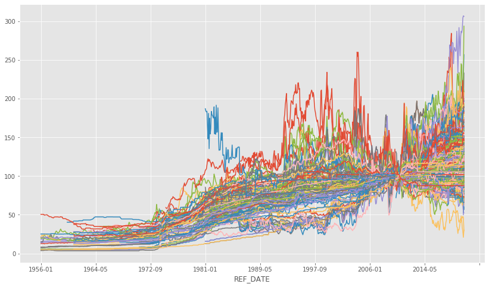
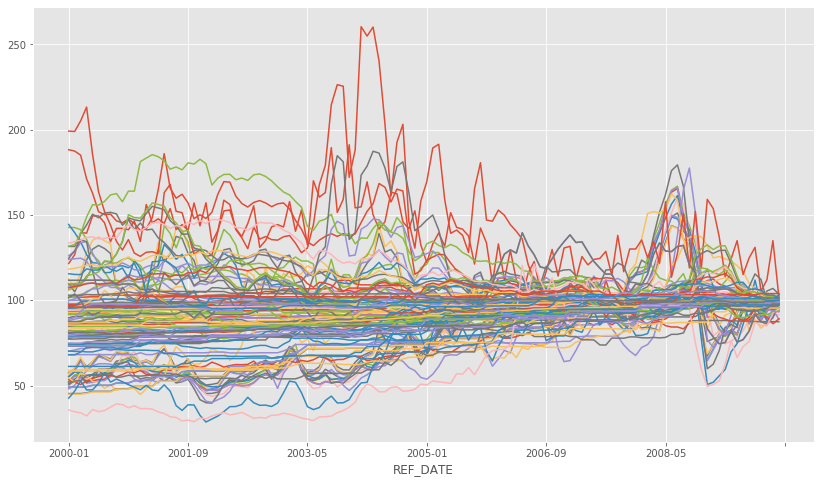

## Data Science for Algorthmmic Trading
### Part 2

- 참고자료 : https://towardsdatascience.com/data-science-in-algorithmic-trading-d21a46d1565d

Initial upload: 2020.07.27
Last update: 2020.07.27


**위 참고자료의 내용을 번역, 필사하고, 일부 내용을 추가한 것이다.**    
여기서는 CAD/USD의 환율 예측이 필요한 부가데이터 IPPI를 가져와서 전처리 한다.


```python
import numpy as np
import pandas as pd
import matplotlib.pyplot as plt
import warnings; warnings.filterwarnings('ignore')
plt.style.use('ggplot')
%matplotlib inline

# Options for pandas
pd.options.display.max_columns = 20
```


### 1. Industrial Product Price Index 데이터 import  

- Part1의 USD/CAD를 예측하는데 도움이 되는 데이터를 가져온다.  

- Industrial Product Price Index(IPPI) 데이터 : [[출 처]](https://open.canada.ca/data/en/dataset/39a39c7c-24f1-4789-8f20-a04bcbf635b0)

- IPPI에 대한 설명 : [[출 처]](https://www23.statcan.gc.ca/imdb/p2SV.pl?Function=getSurvey&SDDS=2318)

  

재화의 가격이 상승하면 경제나 환율 지표에 영향을 미칠것이다.  
그러나 우리가 사용하는 데이터는 몇가지 제약이 있다.(일단 알고만 있자.)  
- 월별데이터만 가지고 있다.: 트레이딩에 사용하기에는 느리다. 
- 이 인덱스는 캐나다와 관련된 것인다. 따라서 USD/CAD 환율에서 미국에 대한 정보는 알기 힘들다.  
- 뉴스와 관련된 데이터는 포함하지 않았고, 다른 데이터 소스도 사용하지 않았다.  


```python
df = pd.read_csv('18100030.csv')
```


```python
df.head()
```

<table border="1" class="dataframe">
  <thead>
    <tr style="text-align: right;">
      <th></th>
      <th>REF_DATE</th>
      <th>GEO</th>
      <th>DGUID</th>
      <th>North American Product Classification System (NAPCS)</th>
      <th>UOM</th>
      <th>UOM_ID</th>
      <th>SCALAR_FACTOR</th>
      <th>SCALAR_ID</th>
      <th>VECTOR</th>
      <th>COORDINATE</th>
      <th>VALUE</th>
      <th>STATUS</th>
      <th>SYMBOL</th>
      <th>TERMINATED</th>
      <th>DECIMALS</th>
    </tr>
  </thead>
  <tbody>
    <tr>
      <th>0</th>
      <td>1956-01</td>
      <td>Canada</td>
      <td>2016A000011124</td>
      <td>Total, Industrial product price index (IPPI)</td>
      <td>Index, 2010=100</td>
      <td>184</td>
      <td>units</td>
      <td>0</td>
      <td>v79309137</td>
      <td>1.1</td>
      <td>15.6</td>
      <td>NaN</td>
      <td>NaN</td>
      <td>NaN</td>
      <td>1</td>
    </tr>
    <tr>
      <th>1</th>
      <td>1956-01</td>
      <td>Canada</td>
      <td>2016A000011124</td>
      <td>Energy and petroleum products [P51]</td>
      <td>Index, 2010=100</td>
      <td>184</td>
      <td>units</td>
      <td>0</td>
      <td>v79309138</td>
      <td>1.2</td>
      <td>NaN</td>
      <td>..</td>
      <td>NaN</td>
      <td>NaN</td>
      <td>1</td>
    </tr>
    <tr>
      <th>2</th>
      <td>1956-01</td>
      <td>Canada</td>
      <td>2016A000011124</td>
      <td>Natural gas liquids and related products [143]</td>
      <td>Index, 2010=100</td>
      <td>184</td>
      <td>units</td>
      <td>0</td>
      <td>v79309139</td>
      <td>1.3</td>
      <td>NaN</td>
      <td>..</td>
      <td>NaN</td>
      <td>NaN</td>
      <td>1</td>
    </tr>
    <tr>
      <th>3</th>
      <td>1956-01</td>
      <td>Canada</td>
      <td>2016A000011124</td>
      <td>Solid fuel products, not elsewhere classified ...</td>
      <td>Index, 2010=100</td>
      <td>184</td>
      <td>units</td>
      <td>0</td>
      <td>v79309140</td>
      <td>1.4</td>
      <td>NaN</td>
      <td>..</td>
      <td>NaN</td>
      <td>NaN</td>
      <td>1</td>
    </tr>
    <tr>
      <th>4</th>
      <td>1956-01</td>
      <td>Canada</td>
      <td>2016A000011124</td>
      <td>Refined petroleum energy products, and biofuel...</td>
      <td>Index, 2010=100</td>
      <td>184</td>
      <td>units</td>
      <td>0</td>
      <td>v79309141</td>
      <td>1.5</td>
      <td>NaN</td>
      <td>..</td>
      <td>NaN</td>
      <td>NaN</td>
      <td>1</td>
    </tr>
  </tbody>
</table>


### 2. 데이터 전처리 하기  
- IPPI 세부 항목별로 지표(VALUE)를 추출한다.

분석에 사용할 컬럼을 선택한다.


```python
categories = list(df[df.columns[3]].drop_duplicates())
 # 같은결과 categories = np.unique(df[df.columns[3]].values)
```


```python
df_cols = ['REF_DATE', 'North American Product Classification System (NAPCS)', 
           'VALUE']
```


```python
df = df[df_cols]
```


```python
df.head()
```

<table border="1" class="dataframe">
  <thead>
    <tr style="text-align: right;">
      <th></th>
      <th>REF_DATE</th>
      <th>North American Product Classification System (NAPCS)</th>
      <th>VALUE</th>
    </tr>
  </thead>
  <tbody>
    <tr>
      <th>0</th>
      <td>1956-01</td>
      <td>Total, Industrial product price index (IPPI)</td>
      <td>15.6</td>
    </tr>
    <tr>
      <th>1</th>
      <td>1956-01</td>
      <td>Energy and petroleum products [P51]</td>
      <td>NaN</td>
    </tr>
    <tr>
      <th>2</th>
      <td>1956-01</td>
      <td>Natural gas liquids and related products [143]</td>
      <td>NaN</td>
    </tr>
    <tr>
      <th>3</th>
      <td>1956-01</td>
      <td>Solid fuel products, not elsewhere classified ...</td>
      <td>NaN</td>
    </tr>
    <tr>
      <th>4</th>
      <td>1956-01</td>
      <td>Refined petroleum energy products, and biofuel...</td>
      <td>NaN</td>
    </tr>
  </tbody>
</table>
- 위의 두번째 컬럼의 내용이 세부항목이다.  

  

그리고 빈 데이터프레임을 하나 준비한다.


```python
new_df = pd.DataFrame(columns=df_cols)
```

기준일을 인덱스로 지정하기


```python
df.index = df['REF_DATE']
new_df.index = new_df['REF_DATE']
```


```python
df = df.drop(['REF_DATE'], axis=1)
new_df = new_df.drop(['REF_DATE'], axis=1)
```


```python
df.head()
```

<table border="1" class="dataframe">
  <thead>
    <tr style="text-align: right;">
      <th></th>
      <th>North American Product Classification System (NAPCS)</th>
      <th>VALUE</th>
    </tr>
    <tr>
      <th>REF_DATE</th>
      <th></th>
      <th></th>
    </tr>
  </thead>
  <tbody>
    <tr>
      <th>1956-01</th>
      <td>Total, Industrial product price index (IPPI)</td>
      <td>15.6</td>
    </tr>
    <tr>
      <th>1956-01</th>
      <td>Energy and petroleum products [P51]</td>
      <td>NaN</td>
    </tr>
    <tr>
      <th>1956-01</th>
      <td>Natural gas liquids and related products [143]</td>
      <td>NaN</td>
    </tr>
    <tr>
      <th>1956-01</th>
      <td>Solid fuel products, not elsewhere classified ...</td>
      <td>NaN</td>
    </tr>
    <tr>
      <th>1956-01</th>
      <td>Refined petroleum energy products, and biofuel...</td>
      <td>NaN</td>
    </tr>
  </tbody>
</table>


```python
new_df.head()
```

<table border="1" class="dataframe">
  <thead>
    <tr style="text-align: right;">
      <th></th>
      <th>North American Product Classification System (NAPCS)</th>
      <th>VALUE</th>
    </tr>
    <tr>
      <th>REF_DATE</th>
      <th></th>
      <th></th>
    </tr>
  </thead>
  <tbody>
  </tbody>
</table>


카테고리를 컬럼으로 하고 그 값을 취하는 루프를 동작시킨다.


```python
for cat in categories:
    # 데이터 일부에 문제가 있으므로 모두 되지 않는다.
    try:
      new_df[cat]=df[df[list(df)[0]]==cat]['VALUE']
    except Exception as e:
      print("failed on",cat,e)
```

    failed on Asphalt (except natural) and asphalt products cannot reindex from a duplicate axis
    failed on Lubricants and other petroleum refinery products cannot reindex from a duplicate axis
    failed on Prepared and packaged seafood products cannot reindex from a duplicate axis
    failed on Coffee and tea cannot reindex from a duplicate axis
    failed on Fresh, frozen and canned fruit and vegetable juices cannot reindex from a duplicate axis
    failed on Bottled water, carbonated soft drinks, other beverages, and ice cannot reindex from a duplicate axis
    failed on Tobacco products cannot reindex from a duplicate axis
    failed on Clothing, footwear and accessories cannot reindex from a duplicate axis
    failed on Pharmaceutical and medicinal products cannot reindex from a duplicate axis
    failed on Plastic resins cannot reindex from a duplicate axis
    failed on Paints, coatings and adhesive products cannot reindex from a duplicate axis
    failed on Waste and scrap of plastic and rubber cannot reindex from a duplicate axis
    failed on Tires cannot reindex from a duplicate axis
    failed on Plastic and foam building and construction materials cannot reindex from a duplicate axis
    failed on Unwrought iron, steel and ferro-alloys cannot reindex from a duplicate axis
    failed on Unwrought aluminum and aluminum alloys cannot reindex from a duplicate axis
    failed on Unwrought precious metals and precious metal alloys cannot reindex from a duplicate axis
    failed on Other unwrought non-ferrous metals and non-ferrous metal alloys cannot reindex from a duplicate axis
    failed on Basic and semi-finished products of aluminum and aluminum alloys cannot reindex from a duplicate axis
    failed on Agricultural, lawn and garden machinery and equipment cannot reindex from a duplicate axis
    failed on Logging, construction, mining and oil and gas field machinery and equipment cannot reindex from a duplicate axis
    failed on Metalworking machinery cannot reindex from a duplicate axis
    failed on Commercial and service industry machinery and equipment cannot reindex from a duplicate axis
    failed on Other industry-specific manufacturing machinery, not elsewhere classified cannot reindex from a duplicate axis
    failed on Computers and computer peripheral equipment cannot reindex from a duplicate axis
    failed on Furniture and fixtures cannot reindex from a duplicate axis
    failed on Waste and scrap of glass cannot reindex from a duplicate axis


```python
new_df.head()
```

<table border="1" class="dataframe">
  <thead>
    <tr style="text-align: right;">
      <th></th>
      <th>North American Product Classification System (NAPCS)</th>
      <th>VALUE</th>
      <th>Total, Industrial product price index (IPPI)</th>
      <th>Energy and petroleum products [P51]</th>
      <th>Natural gas liquids and related products [143]</th>
      <th>Solid fuel products, not elsewhere classified [144]</th>
      <th>Refined petroleum energy products, and biofuels [261]</th>
      <th>Coke and other coke oven products [26111]</th>
      <th>Motor gasoline [26121]</th>
      <th>Motor gasoline, regular</th>
      <th>...</th>
      <th>Cut diamonds (except industrial)</th>
      <th>Cut gems (except diamonds), jewellery findings, and metal coins and tokens</th>
      <th>Precious metal hollowware and flatware</th>
      <th>Costume jewellery and novelties</th>
      <th>Musical instruments (including parts and accessories)</th>
      <th>Other miscellaneous goods</th>
      <th>Buttons, zippers and other notions</th>
      <th>Brooms, mops, dusters, and brushes, and painting pads, rollers and accessories</th>
      <th>Other miscellaneous goods, not elsewhere classified</th>
      <th>Unrecorded optical and magnetic media, and media not elsewhere classified</th>
    </tr>
    <tr>
      <th>REF_DATE</th>
      <th></th>
      <th></th>
      <th></th>
      <th></th>
      <th></th>
      <th></th>
      <th></th>
      <th></th>
      <th></th>
      <th></th>
      <th></th>
      <th></th>
      <th></th>
      <th></th>
      <th></th>
      <th></th>
      <th></th>
      <th></th>
      <th></th>
      <th></th>
      <th></th>
    </tr>
  </thead>
  <tbody>
    <tr>
      <th>1956-01</th>
      <td>NaN</td>
      <td>NaN</td>
      <td>15.6</td>
      <td>NaN</td>
      <td>NaN</td>
      <td>NaN</td>
      <td>NaN</td>
      <td>NaN</td>
      <td>NaN</td>
      <td>NaN</td>
      <td>...</td>
      <td>NaN</td>
      <td>NaN</td>
      <td>NaN</td>
      <td>NaN</td>
      <td>NaN</td>
      <td>NaN</td>
      <td>NaN</td>
      <td>NaN</td>
      <td>NaN</td>
      <td>NaN</td>
    </tr>
    <tr>
      <th>1956-02</th>
      <td>NaN</td>
      <td>NaN</td>
      <td>15.6</td>
      <td>NaN</td>
      <td>NaN</td>
      <td>NaN</td>
      <td>NaN</td>
      <td>NaN</td>
      <td>NaN</td>
      <td>NaN</td>
      <td>...</td>
      <td>NaN</td>
      <td>NaN</td>
      <td>NaN</td>
      <td>NaN</td>
      <td>NaN</td>
      <td>NaN</td>
      <td>NaN</td>
      <td>NaN</td>
      <td>NaN</td>
      <td>NaN</td>
    </tr>
    <tr>
      <th>1956-03</th>
      <td>NaN</td>
      <td>NaN</td>
      <td>15.7</td>
      <td>NaN</td>
      <td>NaN</td>
      <td>NaN</td>
      <td>NaN</td>
      <td>NaN</td>
      <td>NaN</td>
      <td>NaN</td>
      <td>...</td>
      <td>NaN</td>
      <td>NaN</td>
      <td>NaN</td>
      <td>NaN</td>
      <td>NaN</td>
      <td>NaN</td>
      <td>NaN</td>
      <td>NaN</td>
      <td>NaN</td>
      <td>NaN</td>
    </tr>
    <tr>
      <th>1956-04</th>
      <td>NaN</td>
      <td>NaN</td>
      <td>15.7</td>
      <td>NaN</td>
      <td>NaN</td>
      <td>NaN</td>
      <td>NaN</td>
      <td>NaN</td>
      <td>NaN</td>
      <td>NaN</td>
      <td>...</td>
      <td>NaN</td>
      <td>NaN</td>
      <td>NaN</td>
      <td>NaN</td>
      <td>NaN</td>
      <td>NaN</td>
      <td>NaN</td>
      <td>NaN</td>
      <td>NaN</td>
      <td>NaN</td>
    </tr>
    <tr>
      <th>1956-05</th>
      <td>NaN</td>
      <td>NaN</td>
      <td>15.8</td>
      <td>NaN</td>
      <td>NaN</td>
      <td>NaN</td>
      <td>NaN</td>
      <td>NaN</td>
      <td>NaN</td>
      <td>NaN</td>
      <td>...</td>
      <td>NaN</td>
      <td>NaN</td>
      <td>NaN</td>
      <td>NaN</td>
      <td>NaN</td>
      <td>NaN</td>
      <td>NaN</td>
      <td>NaN</td>
      <td>NaN</td>
      <td>NaN</td>
    </tr>
  </tbody>
</table>
<p>5 rows × 1914 columns</p>


```python
new_df.shape
```


    (773, 1914)


### 3. 결과 시각화 하기

전체 데이터 차트 그려보기


```python
new_df.plot(figsize = (14, 8))
plt.legend().remove()
```





특정 구간만 시각화 하기


```python
new_df['2000':'2010'].plot(figsize = (14, 8))
plt.legend().remove()
```





- 2010에 모든 항목의 인덱스가 100에 수렴했다가 이후에 퍼져나가는 것을 확인할 수가 있다.  

### 4. 데이터셋 저장하기


```python
new_df.to_csv('forex_signals.csv')
```

