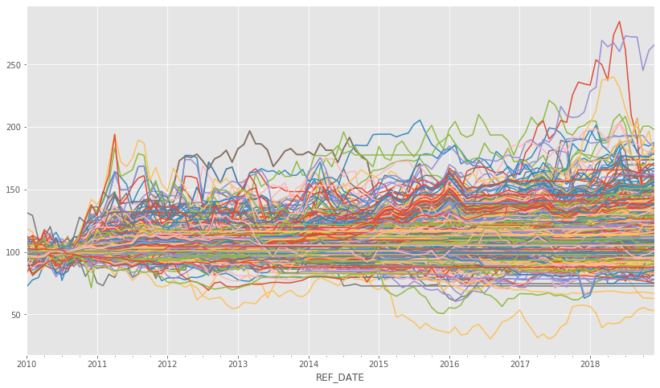
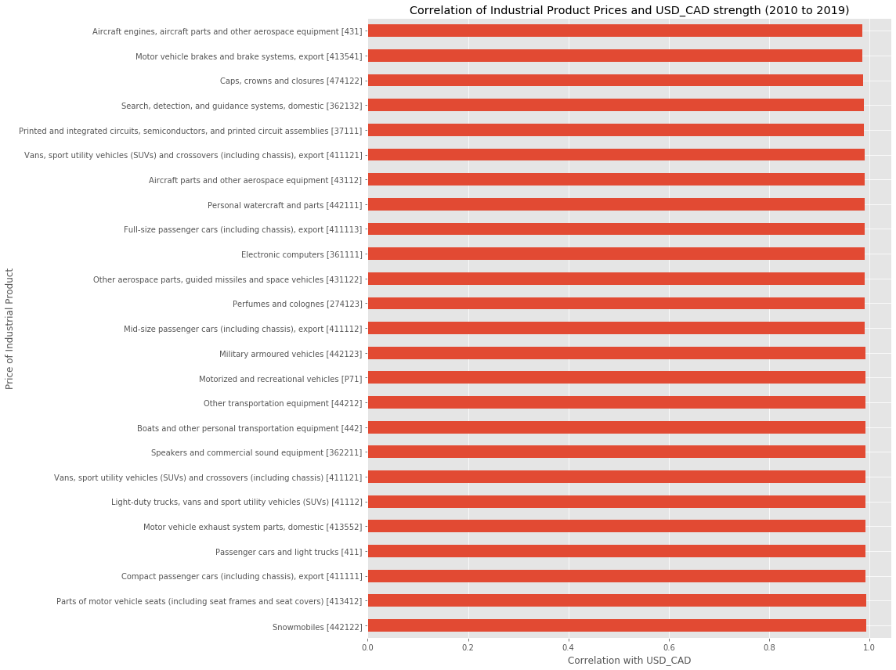
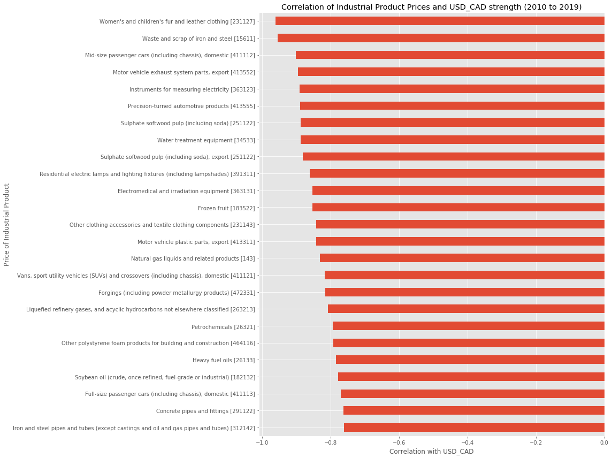
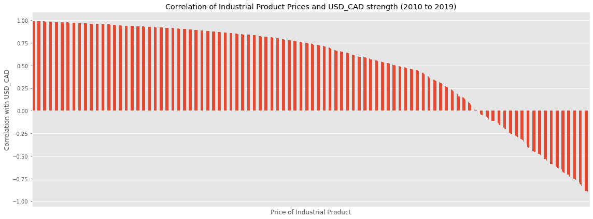
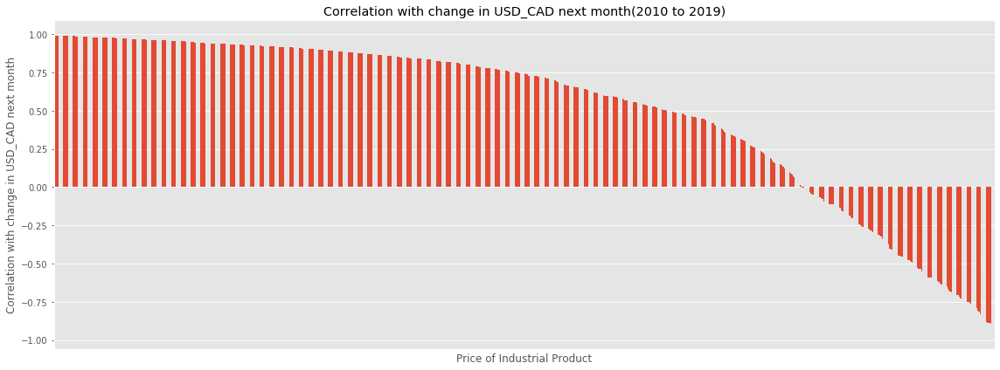
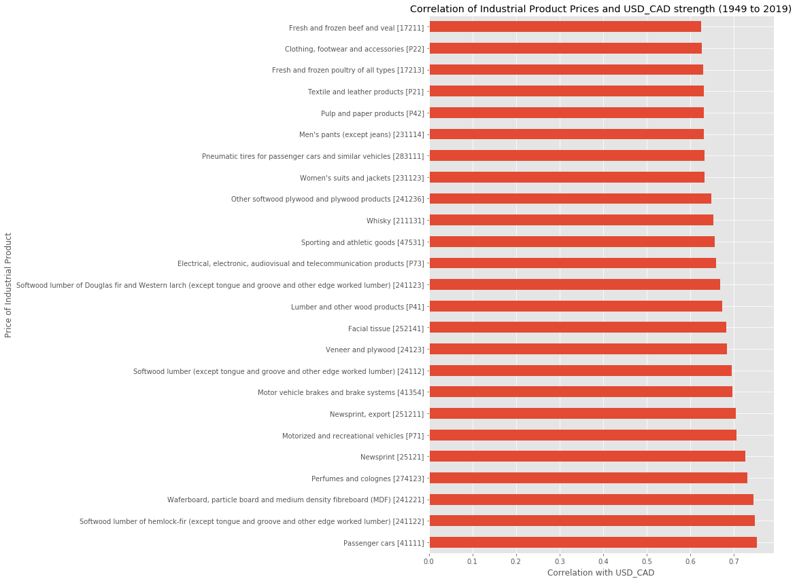
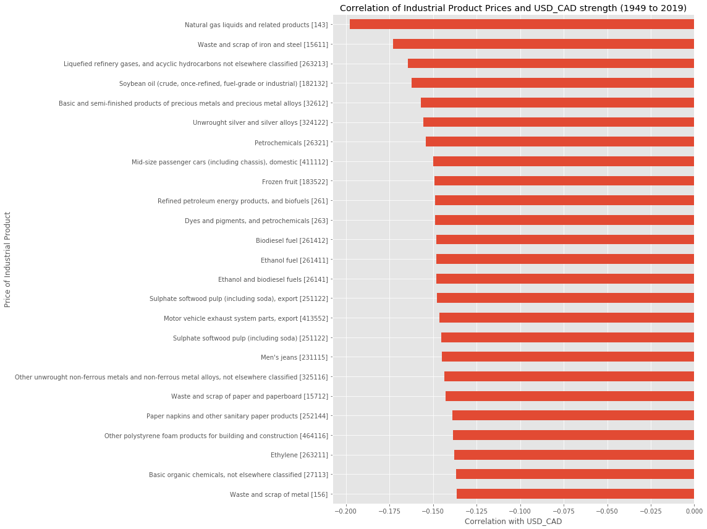
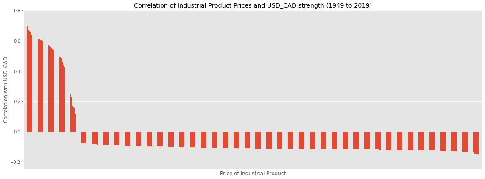

## Data Science for Algorthmmic Trading
### Part 3

- 참고자료 : https://towardsdatascience.com/data-science-in-algorithmic-trading-d21a46d1565d

Initial upload: 2020.07.30  
Last update: 2020.07.30


**위 참고자료의 내용을 번역, 필사하고, 일부 내용을 추가한 것이다.**    
여기서는 지도학습 기반의 환율예측 모델을 만들기 전에 타겟과 피처간의 상관도를 분석해본다.

- 입력은 IPPI 데이터, 그리고 출력은 USD_CAD 예측 값이다


```python
import numpy as np
import pandas as pd
import matplotlib.pyplot as plt
import warnings; warnings.filterwarnings('ignore')
plt.style.use('ggplot')
%matplotlib inline

# Options for pandas
pd.options.display.max_columns = 20
```


### 1. IPPI 데이터 import  

- Part2에서 전처리한 IPPI 데이터를 가져온다.


```python
df = pd.read_csv('forex_signals.csv')
```


```python
df.head()
```


### 2. 데이터 전처리  


```python
# 특정 연도구간의 데이터 추출하는 코드
for startYear,endYear in [[1949,2019],[1990,2000],[2000,2010],[2010,2019]]:
    df_new = pd.read_csv('forex_signals.csv',index_col=0)
    # Keep only the data for the time range that we care about
    if startYear>=1950:
        df_new = df_new[df_new.index>=str(startYear)+'-01']
        df_new = df_new[df_new.index<str(endYear)+'-01']
      # Use the same date format we used for the exchange rate
    df_new.index=pd.to_datetime(df_new.index)
```


```python
df_new #여기서는 2010 ~ 2018년 데이터가 추출 될 것이다.
```

<table border="1" class="dataframe">
  <thead>
    <tr style="text-align: right;">
      <th></th>
      <th>North American Product Classification System (NAPCS)</th>
      <th>VALUE</th>
      <th>Total, Industrial product price index (IPPI)</th>
      <th>Energy and petroleum products [P51]</th>
      <th>Natural gas liquids and related products [143]</th>
      <th>Solid fuel products, not elsewhere classified [144]</th>
      <th>Refined petroleum energy products, and biofuels [261]</th>
      <th>Coke and other coke oven products [26111]</th>
      <th>Motor gasoline [26121]</th>
      <th>Motor gasoline, regular</th>
      <th>...</th>
      <th>Cut diamonds (except industrial)</th>
      <th>Cut gems (except diamonds), jewellery findings, and metal coins and tokens</th>
      <th>Precious metal hollowware and flatware</th>
      <th>Costume jewellery and novelties</th>
      <th>Musical instruments (including parts and accessories)</th>
      <th>Other miscellaneous goods</th>
      <th>Buttons, zippers and other notions</th>
      <th>Brooms, mops, dusters, and brushes, and painting pads, rollers and accessories</th>
      <th>Other miscellaneous goods, not elsewhere classified</th>
      <th>Unrecorded optical and magnetic media, and media not elsewhere classified</th>
    </tr>
    <tr>
      <th>REF_DATE</th>
      <th></th>
      <th></th>
      <th></th>
      <th></th>
      <th></th>
      <th></th>
      <th></th>
      <th></th>
      <th></th>
      <th></th>
      <th></th>
      <th></th>
      <th></th>
      <th></th>
      <th></th>
      <th></th>
      <th></th>
      <th></th>
      <th></th>
      <th></th>
      <th></th>
    </tr>
  </thead>
  <tbody>
    <tr>
      <th>2010-01-01</th>
      <td>NaN</td>
      <td>NaN</td>
      <td>99.1</td>
      <td>99.1</td>
      <td>118.7</td>
      <td>90.8</td>
      <td>99.2</td>
      <td>90.8</td>
      <td>98.3</td>
      <td>98.2</td>
      <td>...</td>
      <td>NaN</td>
      <td>NaN</td>
      <td>NaN</td>
      <td>NaN</td>
      <td>NaN</td>
      <td>NaN</td>
      <td>NaN</td>
      <td>NaN</td>
      <td>NaN</td>
      <td>NaN</td>
    </tr>
    <tr>
      <th>2010-02-01</th>
      <td>NaN</td>
      <td>NaN</td>
      <td>99.0</td>
      <td>97.7</td>
      <td>115.9</td>
      <td>91.3</td>
      <td>97.5</td>
      <td>91.3</td>
      <td>97.9</td>
      <td>97.9</td>
      <td>...</td>
      <td>NaN</td>
      <td>NaN</td>
      <td>NaN</td>
      <td>NaN</td>
      <td>NaN</td>
      <td>NaN</td>
      <td>NaN</td>
      <td>NaN</td>
      <td>NaN</td>
      <td>NaN</td>
    </tr>
    <tr>
      <th>2010-03-01</th>
      <td>NaN</td>
      <td>NaN</td>
      <td>99.0</td>
      <td>99.9</td>
      <td>100.1</td>
      <td>88.7</td>
      <td>100.2</td>
      <td>88.7</td>
      <td>101.4</td>
      <td>101.4</td>
      <td>...</td>
      <td>NaN</td>
      <td>NaN</td>
      <td>NaN</td>
      <td>NaN</td>
      <td>NaN</td>
      <td>NaN</td>
      <td>NaN</td>
      <td>NaN</td>
      <td>NaN</td>
      <td>NaN</td>
    </tr>
    <tr>
      <th>2010-04-01</th>
      <td>NaN</td>
      <td>NaN</td>
      <td>99.5</td>
      <td>100.6</td>
      <td>93.1</td>
      <td>90.5</td>
      <td>101.1</td>
      <td>90.5</td>
      <td>102.1</td>
      <td>102.2</td>
      <td>...</td>
      <td>NaN</td>
      <td>NaN</td>
      <td>NaN</td>
      <td>NaN</td>
      <td>NaN</td>
      <td>NaN</td>
      <td>NaN</td>
      <td>NaN</td>
      <td>NaN</td>
      <td>NaN</td>
    </tr>
    <tr>
      <th>2010-05-01</th>
      <td>NaN</td>
      <td>NaN</td>
      <td>99.9</td>
      <td>98.6</td>
      <td>87.8</td>
      <td>93.6</td>
      <td>98.4</td>
      <td>93.6</td>
      <td>99.4</td>
      <td>99.3</td>
      <td>...</td>
      <td>NaN</td>
      <td>NaN</td>
      <td>NaN</td>
      <td>NaN</td>
      <td>NaN</td>
      <td>NaN</td>
      <td>NaN</td>
      <td>NaN</td>
      <td>NaN</td>
      <td>NaN</td>
    </tr>
    <tr>
      <th>...</th>
      <td>...</td>
      <td>...</td>
      <td>...</td>
      <td>...</td>
      <td>...</td>
      <td>...</td>
      <td>...</td>
      <td>...</td>
      <td>...</td>
      <td>...</td>
      <td>...</td>
      <td>...</td>
      <td>...</td>
      <td>...</td>
      <td>...</td>
      <td>...</td>
      <td>...</td>
      <td>...</td>
      <td>...</td>
      <td>...</td>
      <td>...</td>
    </tr>
    <tr>
      <th>2018-08-01</th>
      <td>NaN</td>
      <td>NaN</td>
      <td>118.7</td>
      <td>129.9</td>
      <td>47.9</td>
      <td>161.4</td>
      <td>130.6</td>
      <td>161.4</td>
      <td>130.7</td>
      <td>129.8</td>
      <td>...</td>
      <td>NaN</td>
      <td>NaN</td>
      <td>NaN</td>
      <td>NaN</td>
      <td>NaN</td>
      <td>NaN</td>
      <td>NaN</td>
      <td>NaN</td>
      <td>NaN</td>
      <td>NaN</td>
    </tr>
    <tr>
      <th>2018-09-01</th>
      <td>NaN</td>
      <td>NaN</td>
      <td>118.9</td>
      <td>130.9</td>
      <td>53.1</td>
      <td>158.6</td>
      <td>131.8</td>
      <td>158.6</td>
      <td>130.1</td>
      <td>129.1</td>
      <td>...</td>
      <td>NaN</td>
      <td>NaN</td>
      <td>NaN</td>
      <td>NaN</td>
      <td>NaN</td>
      <td>NaN</td>
      <td>NaN</td>
      <td>NaN</td>
      <td>NaN</td>
      <td>NaN</td>
    </tr>
    <tr>
      <th>2018-10-01</th>
      <td>NaN</td>
      <td>NaN</td>
      <td>119.1</td>
      <td>131.3</td>
      <td>55.5</td>
      <td>171.5</td>
      <td>131.6</td>
      <td>171.5</td>
      <td>125.0</td>
      <td>123.7</td>
      <td>...</td>
      <td>NaN</td>
      <td>NaN</td>
      <td>NaN</td>
      <td>NaN</td>
      <td>NaN</td>
      <td>NaN</td>
      <td>NaN</td>
      <td>NaN</td>
      <td>NaN</td>
      <td>NaN</td>
    </tr>
    <tr>
      <th>2018-11-01</th>
      <td>NaN</td>
      <td>NaN</td>
      <td>118.0</td>
      <td>122.3</td>
      <td>53.7</td>
      <td>164.3</td>
      <td>121.6</td>
      <td>164.3</td>
      <td>111.1</td>
      <td>109.5</td>
      <td>...</td>
      <td>NaN</td>
      <td>NaN</td>
      <td>NaN</td>
      <td>NaN</td>
      <td>NaN</td>
      <td>NaN</td>
      <td>NaN</td>
      <td>NaN</td>
      <td>NaN</td>
      <td>NaN</td>
    </tr>
    <tr>
      <th>2018-12-01</th>
      <td>NaN</td>
      <td>NaN</td>
      <td>117.1</td>
      <td>113.1</td>
      <td>52.8</td>
      <td>145.7</td>
      <td>111.8</td>
      <td>145.7</td>
      <td>102.7</td>
      <td>100.8</td>
      <td>...</td>
      <td>NaN</td>
      <td>NaN</td>
      <td>NaN</td>
      <td>NaN</td>
      <td>NaN</td>
      <td>NaN</td>
      <td>NaN</td>
      <td>NaN</td>
      <td>NaN</td>
      <td>NaN</td>
    </tr>
  </tbody>
</table>
<p>108 rows × 1914 columns</p>


```python
df_new.plot(figsize = (14, 8), legend = False)
```


    <matplotlib.axes._subplots.AxesSubplot at 0x1f90cd17d08>





데이터 스케일링 : MinMaxScaler


```python
from sklearn.preprocessing import MinMaxScaler
```


```python
scaler = MinMaxScaler()
```


```python
# df_new = scaler.fit_transform(df_new) : 결과로 numpy를 리턴함
```


```python
df_new[df_new.columns] = scaler.fit_transform(df_new)
```


```python
df_new.head()
```

<table border="1" class="dataframe">
  <thead>
    <tr style="text-align: right;">
      <th></th>
      <th>North American Product Classification System (NAPCS)</th>
      <th>VALUE</th>
      <th>Total, Industrial product price index (IPPI)</th>
      <th>Energy and petroleum products [P51]</th>
      <th>Natural gas liquids and related products [143]</th>
      <th>Solid fuel products, not elsewhere classified [144]</th>
      <th>Refined petroleum energy products, and biofuels [261]</th>
      <th>Coke and other coke oven products [26111]</th>
      <th>Motor gasoline [26121]</th>
      <th>Motor gasoline, regular</th>
      <th>...</th>
      <th>Cut diamonds (except industrial)</th>
      <th>Cut gems (except diamonds), jewellery findings, and metal coins and tokens</th>
      <th>Precious metal hollowware and flatware</th>
      <th>Costume jewellery and novelties</th>
      <th>Musical instruments (including parts and accessories)</th>
      <th>Other miscellaneous goods</th>
      <th>Buttons, zippers and other notions</th>
      <th>Brooms, mops, dusters, and brushes, and painting pads, rollers and accessories</th>
      <th>Other miscellaneous goods, not elsewhere classified</th>
      <th>Unrecorded optical and magnetic media, and media not elsewhere classified</th>
    </tr>
    <tr>
      <th>REF_DATE</th>
      <th></th>
      <th></th>
      <th></th>
      <th></th>
      <th></th>
      <th></th>
      <th></th>
      <th></th>
      <th></th>
      <th></th>
      <th></th>
      <th></th>
      <th></th>
      <th></th>
      <th></th>
      <th></th>
      <th></th>
      <th></th>
      <th></th>
      <th></th>
      <th></th>
    </tr>
  </thead>
  <tbody>
    <tr>
      <th>2010-01-01</th>
      <td>NaN</td>
      <td>NaN</td>
      <td>0.004831</td>
      <td>0.245315</td>
      <td>0.826331</td>
      <td>0.019409</td>
      <td>0.266975</td>
      <td>0.019409</td>
      <td>0.272036</td>
      <td>0.289121</td>
      <td>...</td>
      <td>NaN</td>
      <td>NaN</td>
      <td>NaN</td>
      <td>NaN</td>
      <td>NaN</td>
      <td>NaN</td>
      <td>NaN</td>
      <td>NaN</td>
      <td>NaN</td>
      <td>NaN</td>
    </tr>
    <tr>
      <th>2010-02-01</th>
      <td>NaN</td>
      <td>NaN</td>
      <td>0.000000</td>
      <td>0.221465</td>
      <td>0.800187</td>
      <td>0.024030</td>
      <td>0.240741</td>
      <td>0.024030</td>
      <td>0.265957</td>
      <td>0.284650</td>
      <td>...</td>
      <td>NaN</td>
      <td>NaN</td>
      <td>NaN</td>
      <td>NaN</td>
      <td>NaN</td>
      <td>NaN</td>
      <td>NaN</td>
      <td>NaN</td>
      <td>NaN</td>
      <td>NaN</td>
    </tr>
    <tr>
      <th>2010-03-01</th>
      <td>NaN</td>
      <td>NaN</td>
      <td>0.000000</td>
      <td>0.258944</td>
      <td>0.652661</td>
      <td>0.000000</td>
      <td>0.282407</td>
      <td>0.000000</td>
      <td>0.319149</td>
      <td>0.336811</td>
      <td>...</td>
      <td>NaN</td>
      <td>NaN</td>
      <td>NaN</td>
      <td>NaN</td>
      <td>NaN</td>
      <td>NaN</td>
      <td>NaN</td>
      <td>NaN</td>
      <td>NaN</td>
      <td>NaN</td>
    </tr>
    <tr>
      <th>2010-04-01</th>
      <td>NaN</td>
      <td>NaN</td>
      <td>0.024155</td>
      <td>0.270869</td>
      <td>0.587302</td>
      <td>0.016636</td>
      <td>0.296296</td>
      <td>0.016636</td>
      <td>0.329787</td>
      <td>0.348733</td>
      <td>...</td>
      <td>NaN</td>
      <td>NaN</td>
      <td>NaN</td>
      <td>NaN</td>
      <td>NaN</td>
      <td>NaN</td>
      <td>NaN</td>
      <td>NaN</td>
      <td>NaN</td>
      <td>NaN</td>
    </tr>
    <tr>
      <th>2010-05-01</th>
      <td>NaN</td>
      <td>NaN</td>
      <td>0.043478</td>
      <td>0.236797</td>
      <td>0.537815</td>
      <td>0.045287</td>
      <td>0.254630</td>
      <td>0.045287</td>
      <td>0.288754</td>
      <td>0.305514</td>
      <td>...</td>
      <td>NaN</td>
      <td>NaN</td>
      <td>NaN</td>
      <td>NaN</td>
      <td>NaN</td>
      <td>NaN</td>
      <td>NaN</td>
      <td>NaN</td>
      <td>NaN</td>
      <td>NaN</td>
    </tr>
  </tbody>
</table>
<p>5 rows × 1914 columns</p>


환율 데이터와 합치기


```python
rates = pd.read_csv('rates.csv', index_col=['REF_DATE'], 
                   parse_dates=['REF_DATE'])
```


```python
rates.head()
```

<table border="1" class="dataframe">
  <thead>
    <tr style="text-align: right;">
      <th></th>
      <th>USD_CAD</th>
    </tr>
    <tr>
      <th>REF_DATE</th>
      <th></th>
    </tr>
  </thead>
  <tbody>
    <tr>
      <th>1950-10-02</th>
      <td>1.05500</td>
    </tr>
    <tr>
      <th>1950-10-03</th>
      <td>1.05000</td>
    </tr>
    <tr>
      <th>1950-10-04</th>
      <td>1.05250</td>
    </tr>
    <tr>
      <th>1950-10-05</th>
      <td>1.06000</td>
    </tr>
    <tr>
      <th>1950-10-06</th>
      <td>1.05875</td>
    </tr>
  </tbody>
</table>


```python
merged = df_new.join(rates, how = 'inner').fillna(value = 0)
```


```python
merged.head()
```

<table border="1" class="dataframe">
  <thead>
    <tr style="text-align: right;">
      <th></th>
      <th>North American Product Classification System (NAPCS)</th>
      <th>VALUE</th>
      <th>Total, Industrial product price index (IPPI)</th>
      <th>Energy and petroleum products [P51]</th>
      <th>Natural gas liquids and related products [143]</th>
      <th>Solid fuel products, not elsewhere classified [144]</th>
      <th>Refined petroleum energy products, and biofuels [261]</th>
      <th>Coke and other coke oven products [26111]</th>
      <th>Motor gasoline [26121]</th>
      <th>Motor gasoline, regular</th>
      <th>...</th>
      <th>Cut gems (except diamonds), jewellery findings, and metal coins and tokens</th>
      <th>Precious metal hollowware and flatware</th>
      <th>Costume jewellery and novelties</th>
      <th>Musical instruments (including parts and accessories)</th>
      <th>Other miscellaneous goods</th>
      <th>Buttons, zippers and other notions</th>
      <th>Brooms, mops, dusters, and brushes, and painting pads, rollers and accessories</th>
      <th>Other miscellaneous goods, not elsewhere classified</th>
      <th>Unrecorded optical and magnetic media, and media not elsewhere classified</th>
      <th>USD_CAD</th>
    </tr>
    <tr>
      <th>REF_DATE</th>
      <th></th>
      <th></th>
      <th></th>
      <th></th>
      <th></th>
      <th></th>
      <th></th>
      <th></th>
      <th></th>
      <th></th>
      <th></th>
      <th></th>
      <th></th>
      <th></th>
      <th></th>
      <th></th>
      <th></th>
      <th></th>
      <th></th>
      <th></th>
      <th></th>
    </tr>
  </thead>
  <tbody>
    <tr>
      <th>2010-01-01</th>
      <td>0.0</td>
      <td>0.0</td>
      <td>0.004831</td>
      <td>0.245315</td>
      <td>0.826331</td>
      <td>0.019409</td>
      <td>0.266975</td>
      <td>0.019409</td>
      <td>0.272036</td>
      <td>0.289121</td>
      <td>...</td>
      <td>0.0</td>
      <td>0.0</td>
      <td>0.0</td>
      <td>0.0</td>
      <td>0.0</td>
      <td>0.0</td>
      <td>0.0</td>
      <td>0.0</td>
      <td>0.0</td>
      <td>1.0510</td>
    </tr>
    <tr>
      <th>2010-02-01</th>
      <td>0.0</td>
      <td>0.0</td>
      <td>0.000000</td>
      <td>0.221465</td>
      <td>0.800187</td>
      <td>0.024030</td>
      <td>0.240741</td>
      <td>0.024030</td>
      <td>0.265957</td>
      <td>0.284650</td>
      <td>...</td>
      <td>0.0</td>
      <td>0.0</td>
      <td>0.0</td>
      <td>0.0</td>
      <td>0.0</td>
      <td>0.0</td>
      <td>0.0</td>
      <td>0.0</td>
      <td>0.0</td>
      <td>1.0624</td>
    </tr>
    <tr>
      <th>2010-03-01</th>
      <td>0.0</td>
      <td>0.0</td>
      <td>0.000000</td>
      <td>0.258944</td>
      <td>0.652661</td>
      <td>0.000000</td>
      <td>0.282407</td>
      <td>0.000000</td>
      <td>0.319149</td>
      <td>0.336811</td>
      <td>...</td>
      <td>0.0</td>
      <td>0.0</td>
      <td>0.0</td>
      <td>0.0</td>
      <td>0.0</td>
      <td>0.0</td>
      <td>0.0</td>
      <td>0.0</td>
      <td>0.0</td>
      <td>1.0416</td>
    </tr>
    <tr>
      <th>2010-04-01</th>
      <td>0.0</td>
      <td>0.0</td>
      <td>0.024155</td>
      <td>0.270869</td>
      <td>0.587302</td>
      <td>0.016636</td>
      <td>0.296296</td>
      <td>0.016636</td>
      <td>0.329787</td>
      <td>0.348733</td>
      <td>...</td>
      <td>0.0</td>
      <td>0.0</td>
      <td>0.0</td>
      <td>0.0</td>
      <td>0.0</td>
      <td>0.0</td>
      <td>0.0</td>
      <td>0.0</td>
      <td>0.0</td>
      <td>1.0084</td>
    </tr>
    <tr>
      <th>2010-05-01</th>
      <td>0.0</td>
      <td>0.0</td>
      <td>0.043478</td>
      <td>0.236797</td>
      <td>0.537815</td>
      <td>0.045287</td>
      <td>0.254630</td>
      <td>0.045287</td>
      <td>0.288754</td>
      <td>0.305514</td>
      <td>...</td>
      <td>0.0</td>
      <td>0.0</td>
      <td>0.0</td>
      <td>0.0</td>
      <td>0.0</td>
      <td>0.0</td>
      <td>0.0</td>
      <td>0.0</td>
      <td>0.0</td>
      <td>1.0158</td>
    </tr>
  </tbody>
</table>
<p>5 rows × 1915 columns</p>


### 3. 상관도 분석

상관도 계산하기: 타겟인 USD_CAD와의 상관도를 계산한다.


```python
corr = merged.corr()['USD_CAD'].sort_values(ascending = False).dropna()
```

상관도 시각화 하기


```python
def makeFig(plt, title, xlabel, ylabel, fName):
    plt.xlabel(xlabel)
    plt.ylabel(ylabel)
    plt.title(title)
    plt.tight_layout()
    plt.savefig(fName, dpi=100)
    #plt.show()
    return
```


```python
# 높은 상관도를 보이는 25개만 살펴본다.
plt.figure(figsize=(16, 12))
corr[1:26].plot.barh() # 자기상관도를 제외한 25개
title="Correlation of Industrial Product Prices and USD_CAD strength ("+str(startYear)+" to "+str(endYear)+")"
xlabel="Correlation with USD_CAD"
ylabel="Price of Industrial Product"
fName=str(startYear)+'s_corr_high.png'
makeFig(plt, title, xlabel, ylabel, fName)
```





```python
# 낮은 상관도를 보이는 25개 살펴보기
plt.figure(figsize=(16, 12))
corr[-25:].plot.barh()
fName=str(startYear)+'s_corr_low.png'
makeFig(plt, title, xlabel, ylabel, fName)
```





```python
plt.figure(figsize=(16, 6))
corr[1:].plot.bar()
plt.xticks([])  
fName=str(startYear)+'s_histogram_correlations.png'
makeFig(plt, title, ylabel, xlabel, fName)
```





환율 상승에 영향을 미치는 인자 찾기  

- 먼저 환율 변동분('dUSD_CAD') 컬럼을 생성하고, 이 컬럼과 다른 피처와의 상관도를 살펴본다.


```python
merged['dUSD_CAD'] = merged['USD_CAD'].shift(-1) -merged['USD_CAD'] # 환율 변동분
corr2 = merged.corr()['dUSD_CAD'].sort_values(ascending=False).dropna
```


```python
# 환율 상승에 상관성이 높은 인자 찾기
plt.figure(figsize=(16, 6))
corr[1:].plot.bar()
plt.xticks([])
xlabel="Price of Industrial Product"
ylabel="Correlation with change in USD_CAD next month"
title="Correlation with change in USD_CAD next month("+str(startYear)+" to "+str(endYear)+")"
fName=str(startYear)+'s_histogram_predictions.png'
makeFig(plt, title, xlabel, ylabel, fName)
```





전구간 살펴보기 : 1949 ~ 2019


```python
# 1950 ~ 2019년 구간 살펴보기
startYear = 1949
endYear = 2019
df_new = pd.read_csv('forex_signals.csv',index_col=0)

df_new.index=pd.to_datetime(df_new.index)
```


```python
merged = df_new.join(rates, how = 'inner').fillna(value = 0)
```


```python
corr = merged.corr()['USD_CAD'].sort_values(ascending = False).dropna()
```


```python
# 높은 상관도를 보이는 25개만 살펴본다.
plt.figure(figsize=(16, 12))
corr[1:26].plot.barh() # 자기상관도를 제외한 25개
title="Correlation of Industrial Product Prices and USD_CAD strength ("+str(startYear)+" to "+str(endYear)+")"
xlabel="Correlation with USD_CAD"
ylabel="Price of Industrial Product"
fName=str(startYear)+'s_corr_high.png'
makeFig(plt, title, xlabel, ylabel, fName)
```





```python
# 낮은 상관도를 보이는 25개 살펴보기
plt.figure(figsize=(16, 12))
corr[-25:].plot.barh()
fName=str(startYear)+'s_corr_low.png'
makeFig(plt, title, xlabel, ylabel, fName)
```





```python
plt.figure(figsize=(16, 6))
corr[1:].plot.bar()
plt.xticks([])  
fName=str(startYear)+'s_histogram_correlations.png'
makeFig(plt, title, ylabel, xlabel, fName)
```




