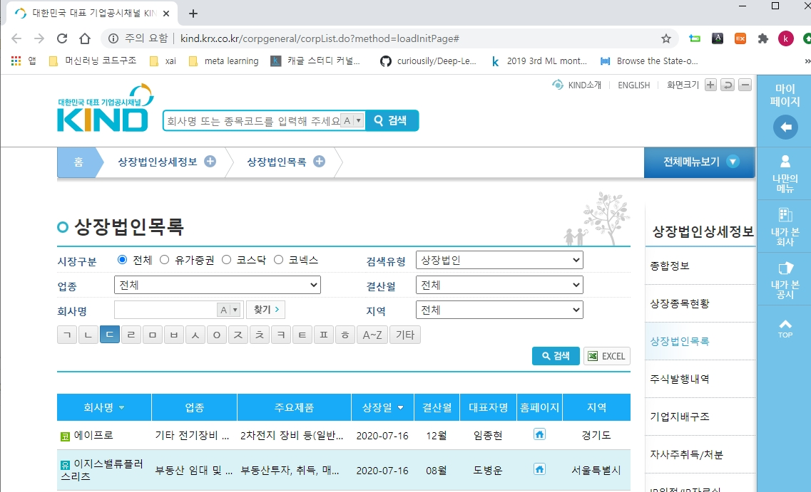
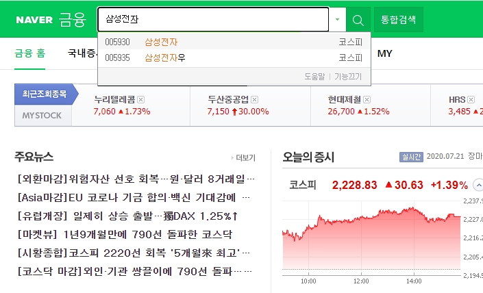
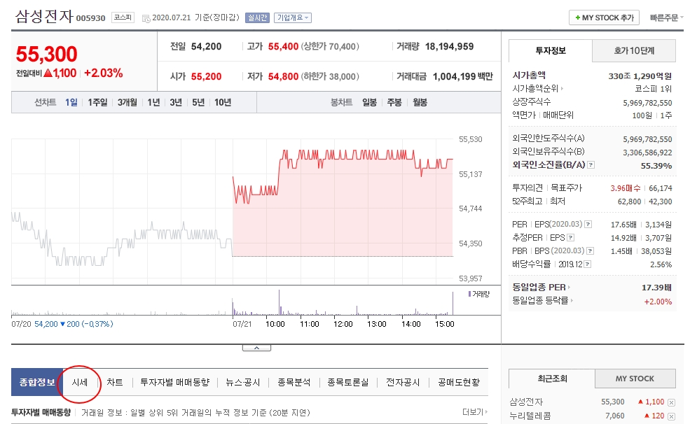
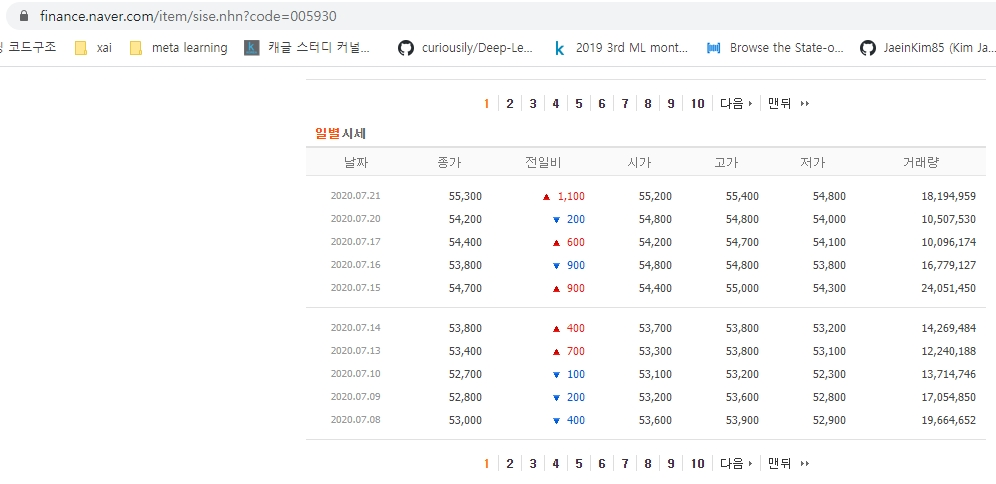
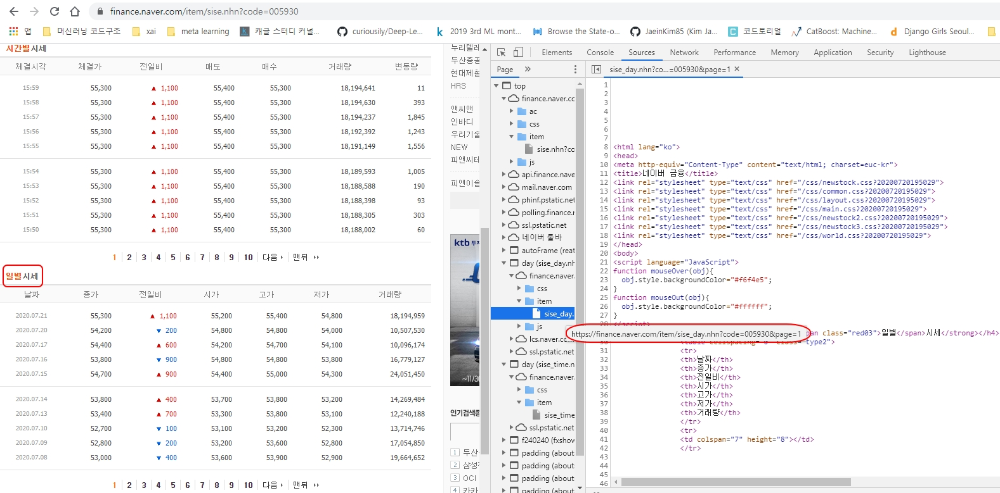
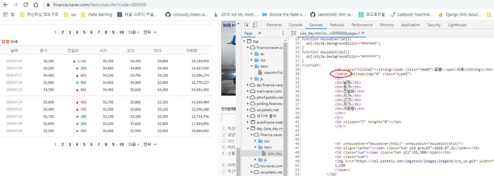

# Stock data analysis
#### part1 : Three ways to import stock data

<div style="text-align: right"> <b>Author : Kwang Myung Yu</b></div> 

<div style="text-align: right"> Initial upload: 2020.07.21 </div> 
<div style="text-align: right"> Last update: 2020.07.23 </div> 


주식 데이터 분석을 위해서 가장 먼저 데이터를 읽어와야 한다.  
네이버증권 크롤링, FinanceDataReader, pandas_datareader/ Yahoo finance 라이브러리를 사용한 3가지 방법에 대하여 소개한다.


### 0. 한국거래소(KRX)에서 종목코드 가져오기  
분석하기 전에 KRX에 기록된 상장기업명과 종목코드(6자리)를 저장해둔다. 종목검색에 활용할 수있다. 


```python
import numpy as np
import pandas as pd
import matplotlib.pyplot as plt
import seaborn as sns
import datetime
import warnings; warnings.filterwarnings('ignore')
plt.style.use('ggplot')
%matplotlib inline
```

먼저 KRX 홈페이지(http://kind.krx.co.kr/)를 방문하여 `장법인상세정보`/ `장법인목록` 화면으로 이동한다.  
(또는 [[다음]](http://kind.krx.co.kr/corpgeneral/corpList.do?method=loadInitPage) 링크를 클릭한다.)



오른쪽 아래의 `EXCEL` 버튼을 클릭하면 상장법인 목록 파일을 다운로드 할 수있다.  
여기서는 `pandas`의 `read_html`을 활용하여 정보를 데이터프레임으로 읽어들인다.  
`read_html()`은 HTML에서 'table' '/table'태그를 찾아 자동으로 DataFrame형식으로 만들어준다.


```python
stock_code = pd.read_html('http://kind.krx.co.kr/corpgeneral/corpList.do?method=download&searchType=13', 
                          header = 0)[0]
# 주의 : 마지막에 [0]을 반드시 추가해야함. read_html은 table들을 읽어 리스트로 저장함
```


```python
stock_code.head()
```

<table border="1" class="dataframe">
  <thead>
    <tr style="text-align: right;">
      <th></th>
      <th>회사명</th>
      <th>종목코드</th>
      <th>업종</th>
      <th>주요제품</th>
      <th>상장일</th>
      <th>결산월</th>
      <th>대표자명</th>
      <th>홈페이지</th>
      <th>지역</th>
    </tr>
  </thead>
  <tbody>
    <tr>
      <th>0</th>
      <td>DSR</td>
      <td>155660</td>
      <td>1차 비철금속 제조업</td>
      <td>합섬섬유로프</td>
      <td>2013-05-15</td>
      <td>12월</td>
      <td>홍석빈</td>
      <td>http://www.dsr.com</td>
      <td>부산광역시</td>
    </tr>
    <tr>
      <th>1</th>
      <td>GS</td>
      <td>78930</td>
      <td>기타 금융업</td>
      <td>지주회사/부동산 임대</td>
      <td>2004-08-05</td>
      <td>12월</td>
      <td>허태수, 홍순기 (각자 대표이사)</td>
      <td>NaN</td>
      <td>서울특별시</td>
    </tr>
    <tr>
      <th>2</th>
      <td>GS글로벌</td>
      <td>1250</td>
      <td>상품 종합 도매업</td>
      <td>수출입업(시멘트,철강금속,전기전자,섬유,기계화학),상품중개,광업,채석업/하수처리 서...</td>
      <td>1976-06-26</td>
      <td>12월</td>
      <td>김태형</td>
      <td>http://www.gsgcorp.com</td>
      <td>서울특별시</td>
    </tr>
    <tr>
      <th>3</th>
      <td>HDC현대산업개발</td>
      <td>294870</td>
      <td>건물 건설업</td>
      <td>외주주택, 자체공사, 일반건축, 토목 등</td>
      <td>2018-06-12</td>
      <td>12월</td>
      <td>권순호, 정경구</td>
      <td>http://www.hdc-dvp.com</td>
      <td>서울특별시</td>
    </tr>
    <tr>
      <th>4</th>
      <td>LG이노텍</td>
      <td>11070</td>
      <td>전자부품 제조업</td>
      <td>기타 전자부품 제조업</td>
      <td>2008-07-24</td>
      <td>12월</td>
      <td>정철동</td>
      <td>http://www.lginnotek.co.kr</td>
      <td>서울특별시</td>
    </tr>
  </tbody>
</table>


국내 주식시장의 종목코드는 6자리 이다. 예를 들어 `GS글로벌`의 종목코드는 `001250`이다.  
그런데 저장된 종목코드는 앞자리 0이 생략되어 있다. `map`함수로 6자리를 완성한다.


```python
stock_code['종목코드'] = stock_code['종목코드'].map('{:06d}'.format)
# 종목코드가 6자리이기 때문에 6자리를 맞춰주기 위해 설정해줌
```

분석에 필요한 컬럼만 추출하고, 컬럼명을 영어로 수정한다. 


```python
stock_code = stock_code[['회사명', '종목코드', '업종', '주요제품']]
stock_code = stock_code.rename(columns = {'회사명':'name', '종목코드':'code', '업종':'sectors','주요제품': 'products'})
```


```python
stock_code.head()
```

<table border="1" class="dataframe">
  <thead>
    <tr style="text-align: right;">
      <th></th>
      <th>name</th>
      <th>code</th>
      <th>sectors</th>
      <th>products</th>
    </tr>
  </thead>
  <tbody>
    <tr>
      <th>0</th>
      <td>DSR</td>
      <td>155660</td>
      <td>1차 비철금속 제조업</td>
      <td>합섬섬유로프</td>
    </tr>
    <tr>
      <th>1</th>
      <td>GS</td>
      <td>078930</td>
      <td>기타 금융업</td>
      <td>지주회사/부동산 임대</td>
    </tr>
    <tr>
      <th>2</th>
      <td>GS글로벌</td>
      <td>001250</td>
      <td>상품 종합 도매업</td>
      <td>수출입업(시멘트,철강금속,전기전자,섬유,기계화학),상품중개,광업,채석업/하수처리 서...</td>
    </tr>
    <tr>
      <th>3</th>
      <td>HDC현대산업개발</td>
      <td>294870</td>
      <td>건물 건설업</td>
      <td>외주주택, 자체공사, 일반건축, 토목 등</td>
    </tr>
    <tr>
      <th>4</th>
      <td>LG이노텍</td>
      <td>011070</td>
      <td>전자부품 제조업</td>
      <td>기타 전자부품 제조업</td>
    </tr>
  </tbody>
</table>


```python
stock_code.shape
```


    (2356, 4)


데이터를 `csv` 확장자 파일로 저장한다.


```python
stock_code.to_csv('data/stock_code.csv', index=False)
```


```python
pd.read_csv('data/stock_code.csv').head()
```

<table border="1" class="dataframe">
  <thead>
    <tr style="text-align: right;">
      <th></th>
      <th>name</th>
      <th>code</th>
      <th>sectors</th>
      <th>products</th>
    </tr>
  </thead>
  <tbody>
    <tr>
      <th>0</th>
      <td>DSR</td>
      <td>155660</td>
      <td>1차 비철금속 제조업</td>
      <td>합섬섬유로프</td>
    </tr>
    <tr>
      <th>1</th>
      <td>GS</td>
      <td>78930</td>
      <td>기타 금융업</td>
      <td>지주회사/부동산 임대</td>
    </tr>
    <tr>
      <th>2</th>
      <td>GS글로벌</td>
      <td>1250</td>
      <td>상품 종합 도매업</td>
      <td>수출입업(시멘트,철강금속,전기전자,섬유,기계화학),상품중개,광업,채석업/하수처리 서...</td>
    </tr>
    <tr>
      <th>3</th>
      <td>HDC현대산업개발</td>
      <td>294870</td>
      <td>건물 건설업</td>
      <td>외주주택, 자체공사, 일반건축, 토목 등</td>
    </tr>
    <tr>
      <th>4</th>
      <td>LG이노텍</td>
      <td>11070</td>
      <td>전자부품 제조업</td>
      <td>기타 전자부품 제조업</td>
    </tr>
  </tbody>
</table>
  
  
```python

```
### 1. 네이버금융에서 종목 데이터 가져오기  
- 참고자료 : https://excelsior-cjh.tistory.com/109

네이버금융(finance.naver.com)에 접속하여 `삼성전자`를 검색해본다.



아래 쪽에 `시세` 버튼을 클릭한다.



페이지 아래쪽에 일별 시세가 표시된다.  
그리고 이 페이지의 주소는  
`https://finance.naver.com/item/sise.nhn?code=` `종목코드` 로 구성되어 있다.  
예를들어 삼성전자의 시세 페이지 주소는  
`https://finance.naver.com/item/sise.nhn?code=005930` 이다.   


이 페이지에서 시세정보는 시간대별 시세, 일별 시세 두가지가 있다.  
우리는 일별 시세에 관심이 있다.  
소스를 살펴보면 일별 시세 정보는 `http://finance.naver.com/item/sise_day.nhn?code=005930`에 있는 것을 확인 할 수가 있다.  
그리고 이 일별 시세 정보는 html에서 `table`로 정의되어 있으므로 `pandas`의 `read_html`을 사용하여 읽어올 수가 있다.  



예를들어 시세의 첫번째 페이지 주소는 `http://finance.naver.com/item/sise_day.nhn?code=005930&page=1`이다.  

먼저 원하는 종목의 시제정보 주소를 리턴하는 함수를 만든다.


```python
def get_url(item_name, stock_code): 
    code = stock_code.query("name=='{}'".format(item_name))['code'].to_string(index=False) 
    url = 'http://finance.naver.com/item/sise_day.nhn?code={}'.format(code)
    url = url.replace(" ", "") #code 뒤에 공백이 생겨, 함수를 추가함
    print("요청 URL = {}".format(url)) 
    return url
```

`삼성전자`의 시세정보 페이지 주소를 리턴하는 함수를 시험해본다.


```python
item_name = '삼성전자'
url = get_url(item_name, stock_code)
```

    요청 URL = http://finance.naver.com/item/sise_day.nhn?code=005930


이제 `read_html()`을 사용하여 일별 시세 정보를 읽어온다.  
여기서는 1 ~ 20 페이지 까지의 정보를 읽어 오도록 한다.


```python
stock_data = pd.DataFrame()
for page in range(1, 21): # 1 ~ 20페이지만 가져오기
    pg_url = '{url}&page={page}'.format(url=url, page=page)
    temp = pd.read_html(pg_url, header=0)[0]
    stock_data = stock_data.append(temp, ignore_index=True)
```


```python
stock_data.head()
```

<table border="1" class="dataframe">
  <thead>
    <tr style="text-align: right;">
      <th></th>
      <th>날짜</th>
      <th>종가</th>
      <th>전일비</th>
      <th>시가</th>
      <th>고가</th>
      <th>저가</th>
      <th>거래량</th>
    </tr>
  </thead>
  <tbody>
    <tr>
      <th>0</th>
      <td>NaN</td>
      <td>NaN</td>
      <td>NaN</td>
      <td>NaN</td>
      <td>NaN</td>
      <td>NaN</td>
      <td>NaN</td>
    </tr>
    <tr>
      <th>1</th>
      <td>2020.07.23</td>
      <td>54100.0</td>
      <td>600.0</td>
      <td>54700.0</td>
      <td>54700.0</td>
      <td>53800.0</td>
      <td>15910888.0</td>
    </tr>
    <tr>
      <th>2</th>
      <td>2020.07.22</td>
      <td>54700.0</td>
      <td>600.0</td>
      <td>55300.0</td>
      <td>55500.0</td>
      <td>54700.0</td>
      <td>12885057.0</td>
    </tr>
    <tr>
      <th>3</th>
      <td>2020.07.21</td>
      <td>55300.0</td>
      <td>1100.0</td>
      <td>55200.0</td>
      <td>55400.0</td>
      <td>54800.0</td>
      <td>18297260.0</td>
    </tr>
    <tr>
      <th>4</th>
      <td>2020.07.20</td>
      <td>54200.0</td>
      <td>200.0</td>
      <td>54800.0</td>
      <td>54800.0</td>
      <td>54000.0</td>
      <td>10507530.0</td>
    </tr>
  </tbody>
</table>


```python
stock_data.tail()
```

<table border="1" class="dataframe">
  <thead>
    <tr style="text-align: right;">
      <th></th>
      <th>날짜</th>
      <th>종가</th>
      <th>전일비</th>
      <th>시가</th>
      <th>고가</th>
      <th>저가</th>
      <th>거래량</th>
    </tr>
  </thead>
  <tbody>
    <tr>
      <th>295</th>
      <td>2019.10.10</td>
      <td>48550.0</td>
      <td>350.0</td>
      <td>48200.0</td>
      <td>49200.0</td>
      <td>48000.0</td>
      <td>18639855.0</td>
    </tr>
    <tr>
      <th>296</th>
      <td>2019.10.08</td>
      <td>48900.0</td>
      <td>1150.0</td>
      <td>47900.0</td>
      <td>49000.0</td>
      <td>47600.0</td>
      <td>14239367.0</td>
    </tr>
    <tr>
      <th>297</th>
      <td>2019.10.07</td>
      <td>47750.0</td>
      <td>250.0</td>
      <td>48350.0</td>
      <td>48700.0</td>
      <td>47650.0</td>
      <td>7047273.0</td>
    </tr>
    <tr>
      <th>298</th>
      <td>2019.10.04</td>
      <td>48000.0</td>
      <td>400.0</td>
      <td>47400.0</td>
      <td>48650.0</td>
      <td>47350.0</td>
      <td>9331695.0</td>
    </tr>
    <tr>
      <th>299</th>
      <td>NaN</td>
      <td>NaN</td>
      <td>NaN</td>
      <td>NaN</td>
      <td>NaN</td>
      <td>NaN</td>
      <td>NaN</td>
    </tr>
  </tbody>
</table>
- 페이지당 (15*페이지수-2)일치의 정보가 저장된다.  

- 위의 예에서는 15*20페이지-2 = 298일치의 정보가 저장되었다.

  

컬럼명과 데이터 타입을 변경한다.


```python
# 한글로 된 컬럼명을 영어로 바꿔줌 
stock_data = stock_data.rename(columns= {'날짜': 'date', '종가': 'close', '전일비': 'diff', 
        '시가': 'open', '고가': 'high', '저가': 'low', '거래량': 'volume'}) 

# 데이터의 타입을 int형으로 바꿔줌 
stock_data[['close', 'diff', 'open', 'high', 'low', 'volume']] = stock_data[['close', 'diff', 'open', 'high', 'low', 'volume']].astype('float64')
```


```python
stock_data.head()
```

<table border="1" class="dataframe">
  <thead>
    <tr style="text-align: right;">
      <th></th>
      <th>date</th>
      <th>close</th>
      <th>diff</th>
      <th>open</th>
      <th>high</th>
      <th>low</th>
      <th>volume</th>
    </tr>
  </thead>
  <tbody>
    <tr>
      <th>0</th>
      <td>NaN</td>
      <td>NaN</td>
      <td>NaN</td>
      <td>NaN</td>
      <td>NaN</td>
      <td>NaN</td>
      <td>NaN</td>
    </tr>
    <tr>
      <th>1</th>
      <td>2020.07.23</td>
      <td>54100.0</td>
      <td>600.0</td>
      <td>54700.0</td>
      <td>54700.0</td>
      <td>53800.0</td>
      <td>15910888.0</td>
    </tr>
    <tr>
      <th>2</th>
      <td>2020.07.22</td>
      <td>54700.0</td>
      <td>600.0</td>
      <td>55300.0</td>
      <td>55500.0</td>
      <td>54700.0</td>
      <td>12885057.0</td>
    </tr>
    <tr>
      <th>3</th>
      <td>2020.07.21</td>
      <td>55300.0</td>
      <td>1100.0</td>
      <td>55200.0</td>
      <td>55400.0</td>
      <td>54800.0</td>
      <td>18297260.0</td>
    </tr>
    <tr>
      <th>4</th>
      <td>2020.07.20</td>
      <td>54200.0</td>
      <td>200.0</td>
      <td>54800.0</td>
      <td>54800.0</td>
      <td>54000.0</td>
      <td>10507530.0</td>
    </tr>
  </tbody>
</table>


`date` 컬럼을 datetime 타입으로 변경한다.


```python
stock_data['date'] = pd.to_datetime(stock_data['date'])
```


```python
stock_data.info()
```

    <class 'pandas.core.frame.DataFrame'>
    RangeIndex: 300 entries, 0 to 299
    Data columns (total 7 columns):
     #   Column  Non-Null Count  Dtype         
    ---  ------  --------------  -----         
     0   date    200 non-null    datetime64[ns]
     1   close   200 non-null    float64       
     2   diff    200 non-null    float64       
     3   open    200 non-null    float64       
     4   high    200 non-null    float64       
     5   low     200 non-null    float64       
     6   volume  200 non-null    float64       
    dtypes: datetime64[ns](1), float64(6)
    memory usage: 16.5 KB


결측치를 제거한다.


```python
stock_data = stock_data.dropna(how = 'any')
```


```python
stock_data.head()
```

<table border="1" class="dataframe">
  <thead>
    <tr style="text-align: right;">
      <th></th>
      <th>date</th>
      <th>close</th>
      <th>diff</th>
      <th>open</th>
      <th>high</th>
      <th>low</th>
      <th>volume</th>
    </tr>
  </thead>
  <tbody>
    <tr>
      <th>1</th>
      <td>2020-07-23</td>
      <td>54100.0</td>
      <td>600.0</td>
      <td>54700.0</td>
      <td>54700.0</td>
      <td>53800.0</td>
      <td>15910888.0</td>
    </tr>
    <tr>
      <th>2</th>
      <td>2020-07-22</td>
      <td>54700.0</td>
      <td>600.0</td>
      <td>55300.0</td>
      <td>55500.0</td>
      <td>54700.0</td>
      <td>12885057.0</td>
    </tr>
    <tr>
      <th>3</th>
      <td>2020-07-21</td>
      <td>55300.0</td>
      <td>1100.0</td>
      <td>55200.0</td>
      <td>55400.0</td>
      <td>54800.0</td>
      <td>18297260.0</td>
    </tr>
    <tr>
      <th>4</th>
      <td>2020-07-20</td>
      <td>54200.0</td>
      <td>200.0</td>
      <td>54800.0</td>
      <td>54800.0</td>
      <td>54000.0</td>
      <td>10507530.0</td>
    </tr>
    <tr>
      <th>5</th>
      <td>2020-07-17</td>
      <td>54400.0</td>
      <td>600.0</td>
      <td>54200.0</td>
      <td>54700.0</td>
      <td>54100.0</td>
      <td>10096174.0</td>
    </tr>
  </tbody>
</table>


데이터를 날짜순으로 정렬한다.


```python
stock_data = stock_data.sort_values(by = 'date')
```


```python
stock_data.head()
```

<table border="1" class="dataframe">
  <thead>
    <tr style="text-align: right;">
      <th></th>
      <th>date</th>
      <th>close</th>
      <th>diff</th>
      <th>open</th>
      <th>high</th>
      <th>low</th>
      <th>volume</th>
    </tr>
  </thead>
  <tbody>
    <tr>
      <th>298</th>
      <td>2019-10-04</td>
      <td>48000.0</td>
      <td>400.0</td>
      <td>47400.0</td>
      <td>48650.0</td>
      <td>47350.0</td>
      <td>9331695.0</td>
    </tr>
    <tr>
      <th>297</th>
      <td>2019-10-07</td>
      <td>47750.0</td>
      <td>250.0</td>
      <td>48350.0</td>
      <td>48700.0</td>
      <td>47650.0</td>
      <td>7047273.0</td>
    </tr>
    <tr>
      <th>296</th>
      <td>2019-10-08</td>
      <td>48900.0</td>
      <td>1150.0</td>
      <td>47900.0</td>
      <td>49000.0</td>
      <td>47600.0</td>
      <td>14239367.0</td>
    </tr>
    <tr>
      <th>295</th>
      <td>2019-10-10</td>
      <td>48550.0</td>
      <td>350.0</td>
      <td>48200.0</td>
      <td>49200.0</td>
      <td>48000.0</td>
      <td>18639855.0</td>
    </tr>
    <tr>
      <th>294</th>
      <td>2019-10-11</td>
      <td>49150.0</td>
      <td>600.0</td>
      <td>49000.0</td>
      <td>49450.0</td>
      <td>48800.0</td>
      <td>7783275.0</td>
    </tr>
  </tbody>
</table>


`date` 컬럼을 인덱스로 지정한다.


```python
stock_data = stock_data.set_index(keys = 'date', drop = True)
```


```python
stock_data.head()
```


<div>
<style scoped>
    .dataframe tbody tr th:only-of-type {
        vertical-align: middle;
    }

    .dataframe tbody tr th {
        vertical-align: top;
    }
    
    .dataframe thead th {
        text-align: right;
    }
</style>

<table border="1" class="dataframe">
  <thead>
    <tr style="text-align: right;">
      <th></th>
      <th>close</th>
      <th>diff</th>
      <th>open</th>
      <th>high</th>
      <th>low</th>
      <th>volume</th>
    </tr>
    <tr>
      <th>date</th>
      <th></th>
      <th></th>
      <th></th>
      <th></th>
      <th></th>
      <th></th>
    </tr>
  </thead>
  <tbody>
    <tr>
      <th>2019-10-04</th>
      <td>48000.0</td>
      <td>400.0</td>
      <td>47400.0</td>
      <td>48650.0</td>
      <td>47350.0</td>
      <td>9331695.0</td>
    </tr>
    <tr>
      <th>2019-10-07</th>
      <td>47750.0</td>
      <td>250.0</td>
      <td>48350.0</td>
      <td>48700.0</td>
      <td>47650.0</td>
      <td>7047273.0</td>
    </tr>
    <tr>
      <th>2019-10-08</th>
      <td>48900.0</td>
      <td>1150.0</td>
      <td>47900.0</td>
      <td>49000.0</td>
      <td>47600.0</td>
      <td>14239367.0</td>
    </tr>
    <tr>
      <th>2019-10-10</th>
      <td>48550.0</td>
      <td>350.0</td>
      <td>48200.0</td>
      <td>49200.0</td>
      <td>48000.0</td>
      <td>18639855.0</td>
    </tr>
    <tr>
      <th>2019-10-11</th>
      <td>49150.0</td>
      <td>600.0</td>
      <td>49000.0</td>
      <td>49450.0</td>
      <td>48800.0</td>
      <td>7783275.0</td>
    </tr>
  </tbody>
</table>
</div>


```python

```

### 2. FinancesDateReader 사용하기  
- 참고자료 : [[FinanceDataReader tutorial]](https://github.com/FinanceData/FinanceDataReader/blob/master/tutorial/FinanceDataReader%20Tutorial%20-%20%EC%97%AC%EB%9F%AC%20%EC%A2%85%EB%AA%A9%EC%9D%98%20%EA%B0%80%EA%B2%A9%EC%9D%84%20%ED%95%9C%EB%B2%88%EC%97%90.ipynb)


```python
# 라이브러리 설치
# !pip -q install finance-datareader
```


```python
import FinanceDataReader as fdr
```

FinanceDataReader 라이브러리로 주식 데이터를 받기 위해서는 종목코드를 인자로 입력해야 한다.  
따라서 `종목명`을 입력하면 `종목 코드`를 리턴하는 함수 `get_code()`를 생성한다. 


```python
def get_code(item_name, stock_code): 
    code = stock_code.loc[stock_code['name'] == item_name, 'code'] 
    return code.values[0]
```


```python
print(get_code('삼성전자', stock_code))
```

    005930


```python
item_code = get_code('삼성전자', stock_code)
stock_data = fdr.DataReader(item_code, '2019-10-01', '2020-7-21')
```


```python
stock_data.head()
```

<table border="1" class="dataframe">
  <thead>
    <tr style="text-align: right;">
      <th></th>
      <th>Open</th>
      <th>High</th>
      <th>Low</th>
      <th>Close</th>
      <th>Volume</th>
      <th>Change</th>
    </tr>
    <tr>
      <th>Date</th>
      <th></th>
      <th></th>
      <th></th>
      <th></th>
      <th></th>
      <th></th>
    </tr>
  </thead>
  <tbody>
    <tr>
      <th>2019-10-01</th>
      <td>48900</td>
      <td>49100</td>
      <td>48650</td>
      <td>48850</td>
      <td>6206035</td>
      <td>-0.004077</td>
    </tr>
    <tr>
      <th>2019-10-02</th>
      <td>48350</td>
      <td>48400</td>
      <td>47600</td>
      <td>47600</td>
      <td>8382463</td>
      <td>-0.025589</td>
    </tr>
    <tr>
      <th>2019-10-04</th>
      <td>47400</td>
      <td>48650</td>
      <td>47350</td>
      <td>48000</td>
      <td>9331695</td>
      <td>0.008403</td>
    </tr>
    <tr>
      <th>2019-10-07</th>
      <td>48350</td>
      <td>48700</td>
      <td>47650</td>
      <td>47750</td>
      <td>7047273</td>
      <td>-0.005208</td>
    </tr>
    <tr>
      <th>2019-10-08</th>
      <td>47900</td>
      <td>49000</td>
      <td>47600</td>
      <td>48900</td>
      <td>14239367</td>
      <td>0.024084</td>
    </tr>
  </tbody>
</table>


```python
stock_data.info()
```

    <class 'pandas.core.frame.DataFrame'>
    DatetimeIndex: 200 entries, 2019-10-01 to 2020-07-21
    Data columns (total 6 columns):
     #   Column  Non-Null Count  Dtype  
    ---  ------  --------------  -----  
     0   Open    200 non-null    int64  
     1   High    200 non-null    int64  
     2   Low     200 non-null    int64  
     3   Close   200 non-null    int64  
     4   Volume  200 non-null    int64  
     5   Change  200 non-null    float64
    dtypes: float64(1), int64(5)
    memory usage: 10.9 KB


```python

```
### 3. Yahoo finance 사용하기

- 참고자료 : [[개발자 깃허브]](https://github.com/ranaroussi/yfinance)  
- 원래는 pandas-datareader 만으로 야후에서 금융데이터를 가져올 수 있었으나, 최근에 데이터 제공방식이 변경되어서 yfinance도 설치해야한다. yfinance는 pandas-datareader가 야후 금융데이터를 크롤링으로 획들할 수 있도록 도와준다.[[참고]](https://m.blog.naver.com/PostView.nhn?blogId=jk940&logNo=221351926965&proxyReferer=https:%2F%2Fwww.google.com%2F)


```python
# !pip install yfinance
# ! pip install pandas-datareader
```


```python
from pandas_datareader import data as pdr
import yfinance as yf
```


```python
yf.pdr_override() # pdr이 야후에서 데이터를 획들할 때 크롤링으로 변경되도록 함
```


```python
def get_code(item_name, stock_code): 
    code = stock_code.loc[stock_code['name'] == item_name, 'code'] 
    return (str(code.values[0]) + '.KS') 
# yf에서 국내증기 검색을 위해서 종목코드.KS를 인자로 입력해야 한다.
```


```python
get_code('삼성전자', stock_code)
```


    '005930.KS'


```python
SEC = pdr.get_data_yahoo(get_code('삼성전자', stock_code), 
                        start = '2019-10-01', end = '2020-7-21')
```

    [*********************100%***********************]  1 of 1 completed


```python
SEC.head()
```

<table border="1" class="dataframe">
  <thead>
    <tr style="text-align: right;">
      <th></th>
      <th>Open</th>
      <th>High</th>
      <th>Low</th>
      <th>Close</th>
      <th>Adj Close</th>
      <th>Volume</th>
    </tr>
    <tr>
      <th>Date</th>
      <th></th>
      <th></th>
      <th></th>
      <th></th>
      <th></th>
      <th></th>
    </tr>
  </thead>
  <tbody>
    <tr>
      <th>2019-10-01</th>
      <td>48900.0</td>
      <td>49100.0</td>
      <td>48650.0</td>
      <td>48850.0</td>
      <td>48850.0</td>
      <td>6206035</td>
    </tr>
    <tr>
      <th>2019-10-02</th>
      <td>48350.0</td>
      <td>48400.0</td>
      <td>47600.0</td>
      <td>47600.0</td>
      <td>47600.0</td>
      <td>8382463</td>
    </tr>
    <tr>
      <th>2019-10-04</th>
      <td>47400.0</td>
      <td>48650.0</td>
      <td>47350.0</td>
      <td>48000.0</td>
      <td>48000.0</td>
      <td>9331695</td>
    </tr>
    <tr>
      <th>2019-10-07</th>
      <td>48350.0</td>
      <td>48700.0</td>
      <td>47650.0</td>
      <td>47750.0</td>
      <td>47750.0</td>
      <td>7047273</td>
    </tr>
    <tr>
      <th>2019-10-08</th>
      <td>47900.0</td>
      <td>49000.0</td>
      <td>47600.0</td>
      <td>48900.0</td>
      <td>48900.0</td>
      <td>14239367</td>
    </tr>
  </tbody>
</table>


```python
SEC.info()
```

    <class 'pandas.core.frame.DataFrame'>
    DatetimeIndex: 198 entries, 2019-10-01 to 2020-07-20
    Data columns (total 6 columns):
     #   Column     Non-Null Count  Dtype  
    ---  ------     --------------  -----  
     0   Open       198 non-null    float64
     1   High       198 non-null    float64
     2   Low        198 non-null    float64
     3   Close      198 non-null    float64
     4   Adj Close  198 non-null    float64
     5   Volume     198 non-null    int64  
    dtypes: float64(5), int64(1)
    memory usage: 10.8 KB
